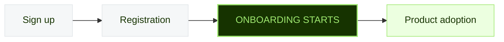
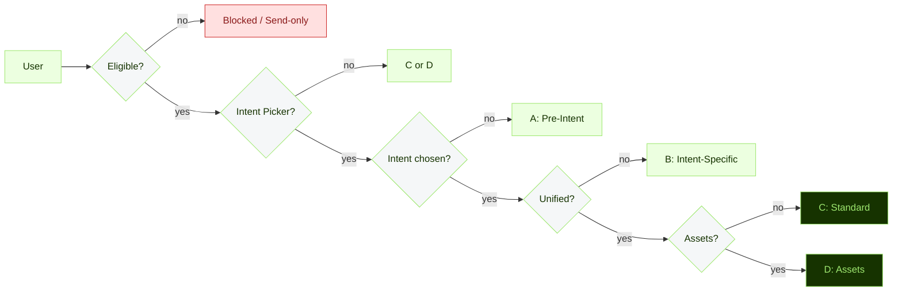
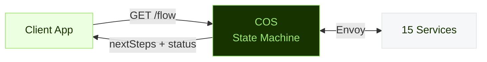
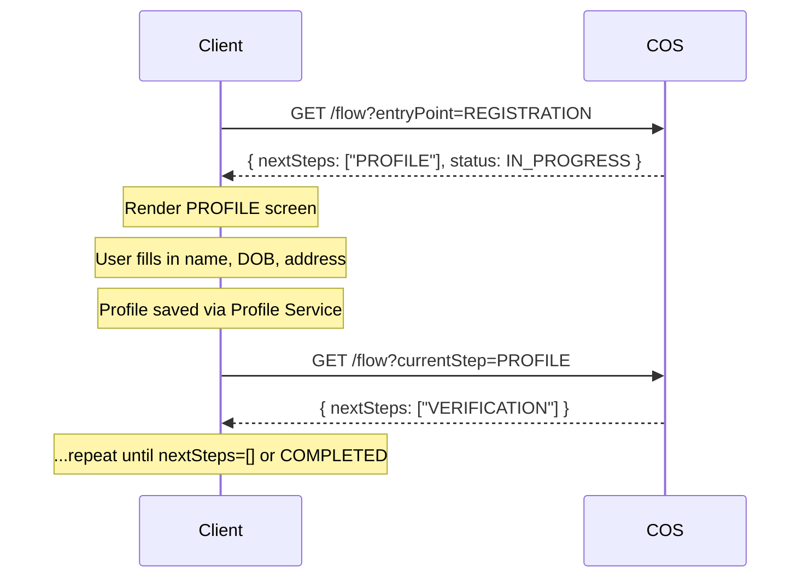

<div class="cover-slide">
  <div style="width: 60px; height: 4px; background: #9fe870; border-radius: 2px; margin-bottom: 1.5rem;"></div>
  <h1>Consumer Onboarding Flow</h1>
  <p style="font-size: 1.3rem; color: #9fe870; font-weight: 600; margin-bottom: 0.25rem;">
    From Sign-Up to First Product
  </p>
  <p>How we guide new personal customers through account setup and product adoption</p>
  <div style="margin-top: 2.5rem; display: flex; gap: 2rem; font-size: 0.85rem; color: #c5ccb8;">
    <span>Consumer Onboarding Team</span>
    <span>·</span>
    <span>Q2 2026</span>
  </div>
</div>

<!--
This presentation covers the Consumer Onboarding Flow end-to-end — what the user sees, how it differs across countries, and how it's built on the backend and each client platform. Part 1 is product-focused: eligibility, intent, the five flows, country rules, and drop-off. Part 2 is technical: architecture, Kafka, client APIs, Web/Android/iOS implementations, and tech debt. Feel free to interrupt with questions at any point — this is meant to be interactive. Timing guide: Part 1 is about 20 minutes (slides 2–15), Part 2 is about 25 minutes (slides 16–31), plus 10–15 minutes for questions. Total ~55–60 minutes. If running long, you can speed through the three client architecture slides (21–23) and point people to the cross-platform comparison table on slide 24 instead.
-->

---
layout: default
class: full-bleed
---

<div class="section-slide">
  <div style="width: 40px; height: 3px; background: #9fe870; border-radius: 2px; margin-bottom: 1.25rem;"></div>
  <h1>Part 1 — Product</h1>
  <p>What the user sees, how it differs across regions, and why it matters</p>
  <div style="margin-top: 2rem; display: flex; gap: 1.5rem; font-size: 0.8rem; color: #c5ccb8;">
    <span>Eligibility</span><span style="opacity:0.4;">·</span>
    <span>Intent</span><span style="opacity:0.4;">·</span>
    <span>Five flows</span><span style="opacity:0.4;">·</span>
    <span>Country rules</span><span style="opacity:0.4;">·</span>
    <span>Drop-off</span>
  </div>
</div>

<!--
Part 1 covers the product side: who's eligible, the intent picker, all five onboarding flows (A through E), how country rules shape the experience, and the 65% drop-off challenge. The goal is to build a mental model of what users actually see — before we dive into the code that makes it work. If you've never used Wise as a customer, this section is especially important context. Aim for ~20 minutes here. The slides with the most discussion potential are Eligibility (slide 6), Five Flows (slide 8), and Drop-off (slide 14) — budget extra time for those.
-->

---

# What Is the Consumer Onboarding Flow?

The bridge between **"I just signed up"** and **"I'm actively using Wise."**

<div class="two-col" style="margin-top: 1rem;">
<div>

### What it does
- Guides customers through **personalized steps** based on who they are and where they are
- Lets them set up their multi-currency account, order a card, get bank details, or start sending money
- **Adapts dynamically** — different countries see different steps in a different order

### Completed when
- Customer adopted at least one product (card, bank details, balance, send)
- OR customer explicitly skipped all options

</div>
<div>

### What it is NOT

<div v-click class="card" style="margin-bottom: 0.5rem;">
  <strong>❌ Not the registration flow</strong><br/>
  <span style="font-size: 0.8rem; color: var(--wise-content-secondary);">Registration happens before onboarding begins</span>
</div>

<div v-click class="card" style="margin-bottom: 0.5rem;">
  <strong>❌ Not business onboarding</strong><br/>
  <span style="font-size: 0.8rem; color: var(--wise-content-secondary);">Business accounts have a separate system</span>
</div>

<div v-click class="card" style="margin-bottom: 0.5rem;">
  <strong>❌ Not a fixed screen sequence</strong><br/>
  <span style="font-size: 0.8rem; color: var(--wise-content-secondary);">It's highly dynamic per user</span>
</div>

<div v-click class="card">
  <strong>❌ Not DynamicFlow</strong><br/>
  <span style="font-size: 0.8rem; color: var(--wise-content-secondary);">Backend-driven but doesn't control UI — it tells clients which screens to show, not how to render them</span>
</div>

</div>
</div>

<div v-click class="card card-dark" style="margin-top: 1rem; font-size: 0.75rem;">
  <strong>Mental model:</strong> Think of it as a state machine, not a wizard. Each call to COS re-evaluates which steps remain based on current user state — there's no stored "you are on step 4." Two users in different countries with different intents see entirely different step sequences.
</div>

<!--
Key distinction: this is NOT the same as registration. Registration creates the account; onboarding guides the user to their first product. Also not business onboarding — that's a separate system sharing the same service (which is a source of coupling we'll discuss later in Tech Debt). The "not a fixed screen sequence" point is important — the flow is dynamic per user, meaning two users in different countries with different intents will see entirely different step sequences. Likely question: "If it's a state machine, where is the state stored?" — Nowhere persistently. COS is stateless — it rebuilds OnboardingState from scratch on every call by querying 15 external services. The "state" is the aggregate of what those services report. No database table, no Redis cache. This is covered in detail on the Architecture slide. Scale context to ground the presentation: in the last 6 months (Oct 2025 – Mar 2026), Wise saw 26M signup attempts → 9.5M registered → 4.1M verified (43%) → 3.0M transacted (32%). This means only about 1 in 3 registered users ever completes a transaction. The onboarding flow sits in the middle of that funnel — it's the bridge between the 9.5M who register and the 3.0M who transact. Combined F1M new-user revenue is ~$2.4M/month across all regions. The H2 2026 target is to move registered-to-transacted from 32% to 40% — an 8pp improvement that, at current registration volumes, would mean ~760K additional transacting users per 6 months.
-->

---

# When Does It Start and End?



### Entry Points — How Users Enter the Flow

| Entry Point | Backend Value | Behavior |
|---|---|---|
| Registration | `REGISTRATION` | Full flow from the beginning |
| My Account | `ACCOUNT` | Resumes from current state |
| Deep link | `DEEPLINK` | Skips intent, personalizes from landing page |
| Content Management | `CONTENT_MANAGEMENT_WISE` | CMS-driven CTA |
| Receive launchpad | `LAUNCHPAD_RECEIVE` | Receive-specific flow (no card steps) |
| Spend launchpad | `LAUNCHPAD_SPEND` | Spend-specific flow |
| Young Explorer → 18 | `YOUNG_EXPLORER_TURNING_18` | Transitions to full onboarding |

<div v-click class="card" style="margin-top: 0.75rem; font-size: 0.75rem;">
<div style="display: flex; align-items: center; gap: 1.5rem;">
  <div style="text-align: center; flex-shrink: 0;">
    <div style="font-size: 1.6rem; font-weight: 700; color: var(--wise-forest);">~90%</div>
    <div style="font-size: 0.65rem; color: var(--wise-content-secondary);">REGISTRATION</div>
  </div>
  <div style="flex: 1;">
    <strong>Registration dominates.</strong> Launchpad entry points serve returning users looking for a specific product. DEEPLINK comes from marketing emails or in-app CTAs. Young Explorer → 18 is small volume but important — these users transition from a limited account on their 18th birthday.
  </div>
</div>
</div>

<!--
REGISTRATION is the primary path — about 90% of onboarding sessions start here. The launchpad entry points are for users who already registered but come back to the app looking for a specific product. DEEPLINK became more important in Q1 2026 — the team shipped mobile deep linking that allows skipping the intent picker and customizing onboarding based on where users come from (specific landing pages, custom App Store listings, ads, QR codes). Both immediate opening (app installed) and deferred opening (app not installed) are handled. The Young Explorer turning 18 path is small volume but important — these users already have a limited account and transition to full onboarding on their 18th birthday. Likely question: "There's a deprecated LAUNCHPAD value in the enum — what happened?" — The original LAUNCHPAD was a single entry point for all launchpad-driven entries. It was split into LAUNCHPAD_RECEIVE and LAUNCHPAD_SPEND to allow different flow routing (receive skips card steps). The old value is @Deprecated but still in the enum for backward compatibility with older mobile clients that might send it.
-->

---

# Flow Resuming — "You Haven't Finished Setting Up"

Most users don't complete onboarding in a single session.

<div class="two-col" style="margin-top: 0.75rem;">
<div>

### How resume works
1. Call `GET /v1/consumer-onboarding/flow/status`
2. Returns `IN_PROGRESS`, `COMPLETED`, or `INELIGIBLE`
3. If `IN_PROGRESS` → show resume prompt
4. Also returns `lastStep` and `shouldShowSurvey`

### On resume
COS **recalculates from scratch** — doesn't jump to a saved position. Evaluates current state and returns whatever comes next.

> If eligibility changed since drop-off, the resumed flow reflects the new reality.

</div>
<div>

### Per-platform behavior

| | iOS | Android | Web |
|---|---|---|---|
| **Prompt** | My Account banner | Survey + Settings card | NBA checklist |
| **Status** | `/flow/status` (7-day cache) | `/flow/status` (no cache) | `/flow/status` + `/flow` |
| **Entry point** | `.account` | Source mapping | URL origin |

<div class="card" style="margin-top: 0.5rem; font-size: 0.75rem;">
  <strong>All platforms call <code>/flow/status</code></strong> — Web uses it for Launchpad navigation and NBA, then calls <code>/flow</code> directly to render onboarding. iOS and Android use it for resume prompts and survey eligibility.
</div>

</div>
</div>

<div v-click class="card" style="margin-top: 0.5rem; font-size: 0.75rem; border-left: 3px solid var(--wise-amber);">
  <strong>iOS cache gotcha:</strong> iOS caches <code>/flow/status</code> for 7 days. If a user drops off and something changes (country adds card support, eligibility shifts), iOS may show a stale resume prompt.
</div>

<div v-click class="card card-green" style="margin-top: 0.5rem; font-size: 0.75rem;">
  <strong>Status API also controls the CES survey.</strong> <code>shouldShowSurvey</code> + <code>lastStep</code> determine if and when to prompt drop-off users. <strong>Survey M4</strong> (in progress) makes survey content backend-driven — adding <code>SurveyResponse</code> and <code>ScheduleCallResponse</code> DTOs so question text, scale, and a "schedule a call" option for low ratings (≤3/7) are all served from <code>/flow/status</code> instead of being hardcoded on clients.
</div>

<!--
The key insight: COS recalculates from scratch on every call. There's no "saved position." If a user drops off after Profile, and by the time they return their country added card support, they'll see card steps they wouldn't have seen before. iOS caches the status call for 7 days — so iOS users might see a stale resume prompt. Web doesn't even check status — it calls /flow directly and either shows the flow or redirects to dashboard. Likely question: "What triggers the resume prompt on Android?" — Android uses a Survey + Settings card approach. The flow status endpoint returns FlowStatus (INELIGIBLE, IN_PROGRESS, COMPLETED) and a shouldShowSurvey boolean. Android maps the entry source via its UnifiedOnboardingSource enum — 11 values that correspond to the 7 backend entry points plus Android-specific sources. Likely question: "What else is being done to re-engage dropped users?" — Two Q1 2026 launches: (1) "How to Videos" on the Launchpad for new customers — short videos based on intent (Send, Spend/Receive, or Default playlists), English-only initially, served from Contentful CMS so content can be updated without code changes. Estimated +2pp job adoption. Eligibility in code (HowToVideoEligibilityService): English language only, non-GB country, personal accounts, within 30 days of registration, and user hasn't completed any job (via FeatureAdoptionService). Platform gates: Android ≥ 9.19.0, iOS ≥ 15683, Web/MobileWeb always eligible. Three playlists: Send (for Send intent users), Spend/Receive (for Spend or Receive intent), and Default (no intent selected). Videos are managed via Contentful CMS with a runbook for non-engineers to prepare and convert video content without code changes. (2) Mobile web native app banner upselling the app download — Safari testing shows ~+1pp increase to 30-day job adoption. Mobile web-to-app conversion matters because mobile web users adopt at 7.5pp lower rate than iOS app users. Likely question: "What exactly makes COS say 'completed'?" — OnboardingFlowStatusService.isComplete() has four paths to true: (1) sportsbar_sponsorship_2026 feature flag enabled for the user (instant bypass); (2) user chose currencies + doesn't need card + has profile + opened balances + no pending bank details; (3) user adopted Send (completed a transfer) or adopted Card (card order DONE); (4) any product order status is DONE. If none of these are true, the status is IN_PROGRESS and the resume prompt shows. Deeper on the sportsbar flag: this is NPG-195, a NorthAm FIFA-adjacent promotion. When enabled via FeatureService.isEnabledForUser(), isComplete() short-circuits to return true — the user is marked as having completed onboarding regardless of actual product adoption. This means NorthAm users in the promotion won't see resume prompts even if they haven't adopted any products. It's the only feature flag that bypasses all completion criteria. Context: NorthAm had 254K registrations in March 2026 (12-month high, +30% YoY) with 40.8% activation — the sportsbar flag could meaningfully inflate "completion" numbers if applied broadly during the promotion window.
-->

---

# Eligibility — Who Gets the Onboarding Flow?

<div class="two-col" style="margin-top: 0.5rem;">
<div>

### Conditions for entering

| Condition | Why |
|---|---|
| Personal account | Business has separate onboarding |
| Not Young Explorer | Has its own experience |
| Country supports MCA | ~80 countries eligible |
| Not in a Send flow | Send intent skips onboarding |

<div class="card card-dark" style="margin-top: 1rem;">
<div style="display: flex; align-items: center; gap: 1.5rem;">
  <div style="text-align: center;">
    <div style="font-size: 1.8rem; font-weight: 700; color: #9fe870;">~80</div>
    <div style="font-size: 0.68rem; color: #c5ccb8;">countries eligible</div>
  </div>
  <div style="font-size: 1.2rem; color: #5a7a4a;">vs</div>
  <div style="text-align: center;">
    <div style="font-size: 1.8rem; font-weight: 700; color: #e8ebe6;">~162</div>
    <div style="font-size: 0.68rem; color: #c5ccb8;">send-only or blocked</div>
  </div>
</div>
<div style="font-size: 0.68rem; color: #8a9b7a; margin-top: 0.5rem;">MCA support is the main gate — most countries lack local banking infrastructure</div>
</div>

</div>
<div>

### What happens if ineligible?

<div v-click class="card" style="margin-bottom: 0.5rem;">
  <span class="tag tag-amber">~140 countries</span>
  <strong style="margin-left: 0.5rem;">Send-only</strong><br/>
  <span style="font-size: 0.75rem; color: var(--wise-content-secondary);">HK, AE, TR, MX, TH, NG… → Direct to transfer flow</span>
</div>

<div v-click class="card" style="margin-bottom: 0.5rem;">
  <span class="tag tag-red">22 countries</span>
  <strong style="margin-left: 0.5rem;">Blocked</strong><br/>
  <span style="font-size: 0.75rem; color: var(--wise-content-secondary);">AF, CU, IR, KP, RU… → No Wise products</span>
</div>

<div v-click class="card">
  <span class="tag tag-blue">Indonesia</span>
  <strong style="margin-left: 0.5rem;">Marketing block</strong><br/>
  <span style="font-size: 0.75rem; color: var(--wise-content-secondary);">Blocked from balance despite being a large market — send only</span>
</div>

</div>
</div>

<!--
The ~80 countries that support MCA (multi-currency account) are the ones eligible for the onboarding flow. The ~140 send-only countries go straight to a transfer flow — they never see onboarding at all. Indonesia is an interesting case: it's a huge market where we could offer balance/card, but marketing decided to keep it send-only for now. That's a business decision, not a technical limitation. The Philippines card block is similar — product catalog says cards are available, but a regional override blocks it. Likely question: "What's the difference between 'blocked' and 'send-only'?" — Blocked countries (22, like CU, IR, KP) can't access Wise at all — no account, no products. Send-only countries (~140) can register and send money but don't get the onboarding flow because they lack MCA support. The user experience is different: blocked users can't even sign up, send-only users sign up but go straight to the transfer flow. Likely question: "Of the ~80 eligible countries, how do the top markets compare?" — From March 2026 funnel deep dives: UK activation rate 40.9% (stable, -1.0pp YoY), NorthAm 40.8% (+3.3pp YoY, US improving from 35.5%→40.3%). Both mature regions hover around 40% activation with Desktop Web consistently outperforming (51.4–51.8%) and Android lagging (29.7–33.8%). The key difference: UK's growth is driven by the UO/Account intent segment doubling in volume with 47.2% activation, while NorthAm's growth comes from compounding mid-funnel KYC improvements. NorthAm's Send-dominant mix (70%) contrasts with UK where Receive is growing fast (+3.6pp to 12.8% of first product). These different compositions mean the same "onboarding" flow serves fundamentally different user needs depending on region. Asia context (March 2026 Deep Dive): Asia overall has the lowest activation at 20.4%. Japan leads Asia at 41.3% (+5.8pp YoY) but per-user revenue is diluting (-30%, $12.85→$8.99). India has only 4.3% activation but the strongest revenue growth (+131% YoY) and improving lower-funnel (+6.8pp KYC Verify→Transact). Indonesia at 9.1% (+2.5pp), also improving lower-funnel. Thailand collapsed catastrophically — activation fell from 15.7% to 3.0% due to a Profile→Intent decline from ~80% to 30.9%, uniform across all platforms (likely regulatory or product change, not bots). Malaysia's 10.5pp activation decline is driven by a bot/spam "Skipped Profile" surge (9.9%→28.5% of registrations). Singapore is stable at 39.4%.
-->

---

# The Intent Picker — "What Do You Want to Do?"

Eligible users are asked what they want to do with Wise. This personalizes the rest of the flow.

<div class="two-col" style="margin-top: 0.75rem;">
<div>

### Intent options

| Intent | What Happens Next |
|---|---|
| **Send money** | Transfer flow — exits onboarding |
| **Spend with card** | Card order flow |
| **Receive / Hold** | Bank details setup |
| **Unified Onboarding** | Full guided flow (most common) |

</div>
<div>

### When it's skipped

| Scenario | Behavior |
|---|---|
| Brazil | Auto-routed to Unified Onboarding |
| Send-only countries | Auto-assigned Send |
| Implicit intent (e.g., card promo) | Intent pre-set |
| UK Current Account | CA-specific redesigned picker |

</div>
</div>

<div v-click class="card" style="margin-top: 1rem; font-size: 0.75rem;">
  <strong>Key insight:</strong> "Send money" exits onboarding entirely — the user goes straight to the transfer flow. "Unified Onboarding" is by far the most common choice and leads to Flow C (Standard). The intent picker is where the personalization divergence begins.
</div>

<div v-click style="margin-top: 0.75rem; display: flex; gap: 0.75rem; font-size: 0.72rem;">
<div class="card" style="flex: 1; text-align: center; padding: 0.6rem;">
  <span class="step-pill flow-shared" style="font-size: 0.62rem;">Send</span>
  <div style="margin-top: 0.3rem; color: var(--wise-negative); font-weight: 600;">Exits onboarding</div>
</div>
<div class="card" style="flex: 1; text-align: center; padding: 0.6rem;">
  <span class="step-pill flow-unique" style="font-size: 0.62rem;">Spend / Receive</span>
  <div style="margin-top: 0.3rem; font-weight: 600;">Flow B</div>
</div>
<div class="card card-dark" style="flex: 1; text-align: center; padding: 0.6rem;">
  <span class="step-pill flow-conditional" style="font-size: 0.62rem;">Unified</span>
  <div style="margin-top: 0.3rem; font-weight: 600;">Flow C or D</div>
</div>
</div>

<!--
The intent picker is where personalization begins. "Unified Onboarding" is the most common choice — it's the full guided experience. If a user picks "Send money," they exit onboarding entirely and go into the transfer flow. Brazil skips the picker because local regulations require showing the full onboarding upfront. The UK Current Account variant has its own redesigned picker because the product framing is different — it emphasizes the current account over the multi-currency account. Important data point: ~30% of customers close or skip the intent picker entirely without choosing an intent or triggering KYC. This is a major leak that Q2's logged-out redesign aims to fix by moving intent selection before registration. Likely question: "What's 'Unified Onboarding' vs the old onboarding?" — Unified Onboarding was the early 2023 redesign that consolidated separate intent-specific flows into a single adaptive flow. Before that, send/spend/receive were entirely separate experiences. Unified Onboarding is now the default — it shows all relevant products in a guided sequence based on the user's country and eligibility. Platform support: intent picker is available on Android ≥ 8.74.0, iOS ≥ 12551, and all web/mobile-web — these are old thresholds, so effectively all current users see it. The eligibility check is in OnboardingSupportsIntentPicker, which is purely a platform version check (not user/country based). Users on ancient app versions that don't support the intent picker go directly to the Unified flow steps. UK Current Account AB Test — Intent Picker Impact (Apr 2026, Feature 10878, Amy Norris / Michele Galli / Anna Nitiuk): The UK CA variant redesigns the intent picker and removes the Explore CTA, making it harder to close without choosing an intent. The routing shift is dramatic: Closed IP nearly disappears (5,513→291, -5,222 users), UO/Account routes jump from 7,799 to 13,800 (+6,001 users), and Send Intent drops from 8,424 to 6,440 (-1,984). The mechanism behind all the product adoption gains is volume, not conversion — the IP routes ~6,000 more users into UO/Account where the product mix is naturally richer, and they convert at the same rate as existing UO users. Key statistically significant wins: Homepage-to-Reg +7.4%, "Any Job" adoption +3.3%, Receive adoption +42.8% (+887 users, p<0.0001), Spend +13.2% (+248 users, p=0.0044), Hold +2.0pp (+591 users, p<0.0001), Card orders +39% (p<0.0001). Send adoption is inconclusive (-0.7pp, p=0.1554 — not statistically significant). Product mix shift: one-off Send drops -2.1pp, but every combo with Receive is up. The biggest shift: Send+Hold drops -3.1pp while Send+Hold+Receive grows +2.7pp — send users who also top up are graduating into receive. Bonus behavioral finding: even within Send Intent (where the experience is identical in control and variant), Send+Hold+Receive adoption goes from 1.8% to 3.0% (+1.2pp, p<0.0001). Users who saw the current account option in the IP come back later to use receive — a pure awareness effect from IP copy alone. LTV analysis backs the trade-off: UK profiles registered in 2024 who adopted Send XCCY + Spend + Receive in their first month show £90.1 avg lifetime revenue (vs £68.0 for Send XCCY Only) and dramatically better retention — 26.3% still transacting every quarter through Q1 2026 vs only 7.7% for Send XCCY Only. So the -2.1pp one-off send drop is a net positive: multi-product users acquired through the CA flow have 3.4x better retention and 32% higher LTV. The "loss" of one-time senders is the system working as designed — filtering low-LTV one-off users and replacing them with high-retention multi-product users. This directly connects to the ~30% IP close/skip problem: the CA variant effectively eliminates IP abandonment (5,513→291) by removing the Explore CTA, forcing intent selection. The logged-out redesign planned for Q2 aims to replicate this effect globally, not just in UK.
-->

---

# The Five Flows

Based on eligibility and intent, users are routed to one of five distinct paths.

<div style="margin-top: 0.75rem;">

| Flow | Name | When | Description |
|---|---|---|---|
| **A** | Pre-Intent | Intent not yet chosen | Profile → Verify → Intent Picker → route to B/C/D/E |
| **B** | Intent-Specific | Picked Send, Spend, or Receive | Minimal steps for chosen intent only |
| **C** | Standard | Unified Onboarding, no assets | Full guided experience — **most common path** |
| **D** | Assets | Eligible for savings/investments | Like Standard but includes Assets step |
| **E** | Receive | From "Receive money" launchpad | Bank details focus — no card steps |

</div>

<div v-click class="three-col" style="margin-top: 1.25rem;">

<div class="card card-dark" style="text-align: center;">
  <div style="font-size: 2rem; font-weight: 700; color: #9fe870;">~70%</div>
  <div style="font-size: 0.75rem; color: #c5ccb8; margin-top: 0.15rem;">Flow C — Standard</div>
  <div style="font-size: 0.68rem; color: #8a9b7a; margin-top: 0.25rem;">Most users land here via Unified Onboarding</div>
</div>

<div class="card" style="text-align: center;">
  <div style="font-size: 1.5rem; font-weight: 700; color: var(--wise-forest);">~15%</div>
  <div style="font-size: 0.75rem; color: var(--wise-content-secondary); margin-top: 0.15rem;">Flow B — Intent-Specific</div>
  <div style="font-size: 0.68rem; color: #8a9b8a; margin-top: 0.25rem;">Send, Spend, or Receive direct</div>
</div>

<div class="card" style="text-align: center;">
  <div style="font-size: 1.5rem; font-weight: 700; color: var(--wise-forest);">~15%</div>
  <div style="font-size: 0.75rem; color: var(--wise-content-secondary); margin-top: 0.15rem;">Flows A, D, E</div>
  <div style="font-size: 0.68rem; color: #8a9b8a; margin-top: 0.25rem;">Pre-intent, Assets, Receive launchpad</div>
</div>

</div>

<!--
Flow C (Standard) is by far the most common — roughly 70% of eligible users land here. Flow A is transient — you pass through it while the intent picker is shown, then get routed to B/C/D/E. Flow E is only reached from the "Receive money" launchpad entry point. The exact distribution varies by region, but C dominates everywhere. Flows D (Assets) is the newest addition (Feb 2024) — it's identical to C but adds the Assets step and moves Balance Consent earlier. When you're working on a feature, start by understanding which flow(s) it affects — most features only touch C. Likely question: "Can a user switch flows mid-onboarding?" — Not directly. The flow is determined at the start based on eligibility and intent. But since COS is stateless and recalculates from scratch, if the user's state changes (e.g., they become assets-eligible), the next GET /flow call could route them to a different flow's steps. In practice this rarely happens mid-session.
-->

---

# Flow Routing Decision Tree

How users get routed to one of the five flows:



<div class="card" style="margin-top: 0.5rem; font-size: 0.75rem;">
  <strong>Flow E (Receive)</strong> isn't shown here — it's only reachable from the Receive launchpad entry point (<code>LAUNCHPAD_RECEIVE</code>), not from the main registration path. Dark green boxes (C, D) are the most common endpoints.
</div>

<!--
Read this left to right. Every user starts at "Eligible?" — if no, they're blocked or send-only and never see onboarding. If eligible, the next question is whether they see the intent picker. If no intent picker (e.g., Brazil auto-routes), they go to C or D depending on assets eligibility. If the intent picker is shown but the user hasn't chosen yet, they're in Flow A (Pre-Intent). Once intent is chosen: non-unified intents go to B, unified without assets go to C, unified with assets go to D. The dark green boxes (C and D) are the most common endpoints. Likely question: "Where in the code is the flow routing decision made?" — OnboardingStepsFactory.getSteps() is the single method that determines which flow's steps to return. It evaluates IntentKey, assets eligibility, and entry point to pick the right step sequence. All five flows are built in that one class.
-->

---

# The Standard Flow — Step by Step

The most common path — each step is conditionally shown.

| # | Step | What the User Sees | Skipped When |
|---|---|---|---|
| 1 | **Identity** | ID verification setup | Profile already completed |
| 2 | **Profile** | Name, DOB, address, occupation | Profile already completed |
| 3 | **Verification** | KYC / identity verification | Not required by compliance |
| 4 | **Requirements** | Legal disclosures | UK Current Account, CDD EU variant 1 |
| 5 | **Currency Selection** | Pick currencies for MCA | India |
| 6 | **Discoverability** | Receive/visibility settings | India |
| 7 | **Card Intro** | Card product introduction | India, UK Current Account |
| 8 | **Card Selection** | Choose card type | Card ordered, or new card onboarding flag |
| 9 | **Balance Consent** | MCA disclosure acceptance | Non-US countries |
| 10 | **Card Order / Bank Details** | Complete card order or get bank details | Depends on card choice |

> Balance Consent position varies — in Assets (D) and Receive (E) flows, it appears earlier.

<!--
Every step has a "skip when" condition — that's the step decider logic. The step decider evaluates the OnboardingState (built from 15 service calls) and decides which steps to include. Balance Consent is US-only — it's a legal requirement for opening an MCA. Note the step count: the backend has 15 step IDs in the enum, but SEND_FLOW and INELIGIBLE are exit signals (not renderable screens). So 13 client-visible steps exist across all flows, and the Standard flow shows 10 of those. Most users see 6–8 depending on their country and what they've already completed. Likely question: "What's the 15th step — INELIGIBLE?" — Yes. The OnboardingStepId enum has 15 values including INELIGIBLE, which is returned when the user isn't eligible (ALWAYS_IF not eligible). It signals "this user can't do onboarding" rather than rendering a screen. SEND_FLOW similarly exits onboarding to the transfer flow. So of the 15 enum values, 2 are exit signals, leaving 13 actual onboarding steps including INTENT_PICKER. The table shows 10 for Standard because not all 13 appear in every flow.
-->

---

# Step Sequences by Flow

<div style="font-size: 0.75rem; margin-top: 0.5rem;">

<div v-click>

### Flow C — Standard (most common)

<div class="step-sequence">
  <span class="step-pill flow-shared">Identity</span><span class="step-arrow">→</span>
  <span class="step-pill flow-shared">Profile</span><span class="step-arrow">→</span>
  <span class="step-pill flow-shared">Verify</span><span class="step-arrow">→</span>
  <span class="step-pill flow-shared">Requirements</span><span class="step-arrow">→</span>
  <span class="step-pill flow-unique">Currency Sel.</span><span class="step-arrow">→</span>
  <span class="step-pill flow-shared">Discover</span><span class="step-arrow">→</span>
  <span class="step-pill flow-unique">Card Intro</span><span class="step-arrow">→</span>
  <span class="step-pill flow-shared">Card Sel.</span><span class="step-arrow">→</span>
  <span class="step-pill flow-conditional">Bal. Consent</span><span class="step-arrow">→</span>
  <span class="step-pill flow-shared">Card Order</span><span class="step-arrow">→</span>
  <span class="step-pill flow-shared">Bank Details</span>
</div>

</div>

<div v-click>

### Flow D — Assets

<div class="step-sequence">
  <span class="step-pill flow-shared">Identity</span><span class="step-arrow">→</span>
  <span class="step-pill flow-shared">Profile</span><span class="step-arrow">→</span>
  <span class="step-pill flow-shared">Verify</span><span class="step-arrow">→</span>
  <span class="step-pill flow-shared">Requirements</span><span class="step-arrow">→</span>
  <span class="step-pill flow-conditional">Bal. Consent</span><span class="step-arrow">→</span>
  <span class="step-pill flow-unique">Assets</span><span class="step-arrow">→</span>
  <span class="step-pill flow-shared">Discover</span><span class="step-arrow">→</span>
  <span class="step-pill flow-unique">Card Intro</span><span class="step-arrow">→</span>
  <span class="step-pill flow-shared">Card Sel.</span><span class="step-arrow">→</span>
  <span class="step-pill flow-shared">Card Order</span><span class="step-arrow">→</span>
  <span class="step-pill flow-shared">Bank Details</span>
</div>

</div>

<div v-click>

### Flow E — Receive

<div class="step-sequence">
  <span class="step-pill flow-shared">Identity</span><span class="step-arrow">→</span>
  <span class="step-pill flow-shared">Profile</span><span class="step-arrow">→</span>
  <span class="step-pill flow-shared">Verify</span><span class="step-arrow">→</span>
  <span class="step-pill flow-shared">Reqs</span><span class="step-arrow">→</span>
  <span class="step-pill flow-conditional">Bal. Con.</span><span class="step-arrow">→</span>
  <span class="step-pill flow-unique">Assets / Curr.</span><span class="step-arrow">→</span>
  <span class="step-pill flow-shared">Discover</span><span class="step-arrow">→</span>
  <span class="step-pill flow-shared">Bank Details</span>
</div>

</div>

<div style="margin-top: 0.75rem; display: flex; gap: 1rem; font-size: 0.72rem;">
  <span><span class="step-pill flow-shared" style="font-size: 0.65rem;">Shared</span> — appears in all flows</span>
  <span><span class="step-pill flow-unique" style="font-size: 0.65rem;">Unique</span> — specific to this flow</span>
  <span><span class="step-pill flow-conditional" style="font-size: 0.65rem;">Conditional</span> — US only / depends on eligibility</span>
</div>

<div v-click class="card" style="margin-top: 0.5rem; font-size: 0.75rem;">
  <strong>Pattern:</strong> First 4 steps are always the same (compliance block). Flows diverge after Requirements — D moves Balance Consent early, E drops card steps entirely.
</div>

</div>

<!--
Only flows C, D, and E are shown here — Flow A (Pre-Intent) is transient (just the first four steps until intent is chosen), and Flow B (Intent-Specific) varies based on which intent the user picks, so there's no single fixed sequence to show. Notice how the first four steps (Identity, Profile, Verify, Requirements) are shared across all three flows — they're the "compliance block" that every user must go through. The key difference between C and D: the Assets flow moves Balance Consent earlier and adds the Assets step. Flow E (Receive) is the shortest — no card steps at all, just bank details. The conditional Balance Consent step only appears for US users due to MCA disclosure requirements. Likely question: "Why does Flow D move Balance Consent earlier?" — Assets eligibility depends on having MCA consent. If Balance Consent stayed in its Standard position (after Card Intro), users would see the Assets step before consenting, which would break the legal prerequisite. Moving it before Assets ensures consent is obtained first. Bonus detail: AssetsOnboardingStep has a fallbackStepId() pointing to CURRENCY_SELECTION — if a user completed Assets but then lost eligibility mid-flow, the step ordering logic falls back to Currency Selection's position in the sequence. This resilience pattern is unique to the Assets step.
-->

---

# Country Product Availability

<div style="margin-top: 0.25rem;">

| Tier | Products | # | Key Countries | Flow |
|---|---|---|---|---|
| **1** — Full Suite | Send + Balance + Card + Bank Details + Assets | 33 | AU, BR, DE, FR, GB, US, SG | Standard or Assets |
| **2** — No Assets | Send + Balance + Card + Bank Details | 24 | CA, JP, NZ, BE, MY | Standard always |
| **3** — India | Send + Balance + Card (no Bank Details, no Assets) | 1 | IN | Stripped Standard |
| **4** — No Card | Send + Balance + Bank Details | 23 | AR, ZA, IL, KR, SA | Standard, no card steps |
| **5** — Send Only | Send | ~140 | HK, AE, TR, MX, TH, NG | Not eligible for onboarding |
| **0** — Blocked | None | 22 | AF, CU, IR, KP, RU | No access |

</div>

<div style="margin-top: 1rem;">
  <div style="font-size: 0.72rem; font-weight: 600; color: var(--wise-forest); margin-bottom: 0.35rem;">Country distribution across tiers</div>
  <div style="display: flex; height: 32px; border-radius: 8px; overflow: hidden; font-size: 0.62rem; font-weight: 600;">
    <div style="flex: 33; background: #163300; color: #9fe870; display: flex; align-items: center; justify-content: center;">Tier 1 — 33</div>
    <div style="flex: 24; background: #2d5a0e; color: #cdffad; display: flex; align-items: center; justify-content: center;">Tier 2 — 24</div>
    <div style="min-width: 50px; background: #9fe870; color: #163300; display: flex; align-items: center; justify-content: center;">IN (1)</div>
    <div style="flex: 23; background: #cdffad; color: #163300; display: flex; align-items: center; justify-content: center;">Tier 4 — 23</div>
    <div style="flex: 140; background: #e2e6e9; color: var(--wise-content-secondary); display: flex; align-items: center; justify-content: center;">Send Only — ~140</div>
    <div style="flex: 22; background: #ffe0e0; color: #8b1a1a; display: flex; align-items: center; justify-content: center;">Blocked — 22</div>
  </div>
  <div style="display: flex; justify-content: space-between; margin-top: 0.35rem; font-size: 0.65rem; color: var(--wise-content-secondary);">
    <span><strong style="color: var(--wise-forest);">~81 countries</strong> get onboarding</span>
    <span><strong style="color: var(--wise-content-secondary);">~162 countries</strong> don't</span>
  </div>
</div>

<div v-click class="card" style="margin-top: 0.75rem; font-size: 0.75rem;">
  <strong>Revenue implication:</strong> Tier 1 countries (33) generate the highest per-user revenue — full product suite means more cross-sell opportunities. India (Tier 3) has massive volume but a stripped flow. The business case for expanding Tier 4 → Tier 2 (adding card support) is active for several countries.
</div>

<!--
Tier 1 is where we make the most money per user — full product suite, 33 countries including all the major markets. India (Tier 3) is special: huge user base but no bank details and no assets, so a stripped-down flow. The ~140 send-only countries are mostly emerging markets where we have corridors but no local banking infrastructure. The stacked bar at the bottom shows the key insight: only about a third of supported countries get the full onboarding experience. Likely question: "How is country tier determined — is it hardcoded?" — Not exactly. The tier is an emergent property of what the Availability and Balance services report for a given country. COS doesn't have a "tier" concept — it asks "does this country support MCA? cards? bank details? assets?" and the resulting combination determines the effective tier. Adding card support to a Tier 4 country just means updating the Card service's country config. Regional revenue context (March 2026 funnel deep dives): NorthAm leads in absolute F1M revenue at $897.5K (+31% YoY) with $9.48 per user. UK generates $306K (+34% YoY) at $9.45 per user. Both regions show volume-driven growth without per-user dilution. NorthAm's Send-dominant mix (70%) generates consistent per-transaction fees. UK's growing UO/Account segment (doubled to 29K) converts at 47.2% activation — these full-suite Tier 1 users are the most valuable. Platform matters: Desktop Web leads activation everywhere (UK 51.8%, NorthAm 51.4%), while Android consistently lags (UK 33.8%, NorthAm 29.7%). This 20pp+ gap between Desktop Web and Android is a universal pattern across regions. Europe-specific data: Germany (Tier 1, 51K regs/month) leads Europe at 41.2% activation (+2.4pp YoY). Netherlands is the highest-performing European country at 43.6%. Italy shows the strongest improvement (+4.2pp). However, Europe's overall 31.5% activation is dragged down by a structural Profile→Intent decline (-9.9pp YoY) and anomalous traffic from Ukraine (28K regs, 1.3% activation) and the Feb 2026 Germany bot spike (230K fake registrations). Receive as first product grew fastest in Europe (+5.3pp to 15.2%) — suggesting Wise is increasingly used as a receiving account by freelancers and cross-border workers. Asia-specific data: India (Tier 3, stripped flow) has only 4.3% activation but is the fastest-growing revenue market (+131% YoY, $13.1K→$30.3K) with high per-user revenue ($15.12). India's lower-funnel is improving (+6.8pp KYC Verify→Transact) — the problem is entirely upper-funnel. Japan (Tier 2, eKYC coming Q2) leads Asia at 41.3% activation but per-user revenue diluted -30% ($12.85→$8.99) as volume grew. Indonesia (send-only, Tier 5) has 9.1% activation — low but improving. Thailand collapsed from 15.7% to 3.0% activation in Feb-Mar 2026 (urgent investigation flagged). Revenue across all regions (March 2026): NorthAm $897.5K, Europe $784.6K, Asia $411.3K, UK $306K — total ~$2.4M F1M new-user revenue per month.
-->

---

# Country-Specific Exceptions

| Country | What's Different | Why |
|---|---|---|
| **US** | Extra "Balance Consent" step | MCA Disclosure — legal requirement |
| **India** | Skips Currency Selection, Card Intro, Discoverability | Simplified flow — no bank details |
| **Indonesia** | Blocked from balance/card | Marketing decision — send only |
| **Philippines** | Card blocked despite product catalog | Regional override via `RegionalOnboardingFlowService` |
| **UK** | Current Account variant (permanent) | `CurrentAccountEligibilityService`: PERSONAL + GB + not Young Explorer |
| **Brazil** | Intent Picker skipped | Auto-routed to Unified Onboarding |

<div v-click>

### Regional Flow Differences

| Region | Behavior |
|---|---|
| **EU** | Identity verification during onboarding (CDD) since Feb 2026 — ID + liveness check |
| **UK** | Current Account positioning. Home currency unboxing (personal + business from Apr 27) |
| **Japan** | eKYC — NFC "Tap to Verify" or manual entry (MVP in progress) |
| **US/Canada** | No KYC at zero — send under threshold without verification |

</div>

<!--
EU CDD (Customer Due Diligence) is the newest addition — went live February 2026. It adds ID verification + liveness check during onboarding for EU users. Before CDD, EU users weren't verified until they tried to send larger amounts. Notably, the CDD iteration (PEOV-1811) introduced shouldSkipRequirements — variant 1 of the new CDD EU flow can skip the Requirements step entirely, changing RequirementsOnboardingStep to return ONCE_IF with an additional &&!shouldSkipRequirements() condition. Japan's eKYC is unique — users can either tap their physical card on their phone (NFC) or manually enter card details. The UK Current Account is now permanent — it started as an experiment and was rolled out fully. The UK home currency unboxing experience has two key recent changes: (1) business account owners can now see the unboxing (BUSINESS_ACCOUNT_UNBOXING_LAUNCH_DATE set to Apr 27, 2026 — RA-6444), and (2) the eligibility check now validates that the bank details order's balance is the primary balance (balancePrimary check, commit 39535977) — this prevents the unboxing from showing for secondary/non-primary balances. The unboxing uses HomeCurrencyUnboxingEligibilityChecker, which checks: profile type → account-structure feature → account-unboxing feature → completed home-currency bank details order after launch date → balance is primary. For personal accounts, the launch date is Mar 23, 2026; for business, Apr 27, 2026. Likely question: "Why Philippines specifically for card blocking?" — It's a single hardcoded check in RegionalOnboardingFlowService.eligibleForCard(): if country is PH, return false. This is combined with base eligibility in OnboardingDataService, so even though the product catalog says cards are available in the Philippines, the regional override blocks it. Philippines is the only country with a hardcoded card restriction at the flow level — Indonesia's block is at the marketing/product level, not in COS code. Likely question: "Is the UK unboxing effective?" — Analysis from Apr 2026 (Confluence: "Exposing Unboxing Post-Issuance vs Next Session") shows the current approach triggers unboxing on next session, but 50% of UK users already have ADs issued when they finish onboarding. The recommendation is to move unboxing to trigger post-issuance (same session) instead of next session. Evidence from the top-up removal V2 (journey resumer): +2.7pp lift in ADs Issued → First Deposit and +1.3pp in First 3P Deposit when users are nudged immediately. 50% of users who don't have ADs at onboarding get them within 9 minutes, 75% within 90 minutes. Users with ADs ready at onboarding show 13.5% 5-day deposit rate vs 8.4% for those without — the post-issuance nudge targets this already-strong population. UK funnel context (March 2026 Deep Dive, Kevin Yuan): UK activation rate is 40.9% (stable, -1.0pp YoY). The standout trend is UO/Account intent nearly doubling (15.3K→29.0K users) with activation jumping 31.6%→47.2% — these are the users the Current Account variant is designed for, and they're converting exceptionally well. Desktop Web outperforms at 51.8% activation (vs Android 33.8%). Receive as first product is growing (9.2%→12.8%), Spend declining (15.9%→10.9%). Revenue: $306K (+34% YoY), per-user $9.45 (+15%). NorthAm funnel context (March 2026 Deep Dive): NorthAm activation rate is 40.8% (+3.3pp YoY). US is closing the activation gap with CA (35.5%→40.3% vs CA stable ~42.2%). Send dominates product mix at 70% (highest of any region). The March 254K registrations are the highest in 12 months — possibly driven by US tax season. Revenue: $897.5K (+31% YoY), per-user $9.48. The sportsbar_sponsorship_2026 flag (NPG-195) is relevant here — it bypasses all onboarding completion criteria for NorthAm users during the FIFA-adjacent promotion, meaning those users count as "completed" regardless of actual product adoption. This could inflate NorthAm completion metrics during the promotion period. Europe funnel context (March 2026 Deep Dive): Europe activation rate is 31.5% — notably lower than UK (40.9%) and NorthAm (40.8%). The biggest concern is a structural Profile→Intent decline of -9.9pp (79.6%→69.7%) — a steady ~2.5pp drop per quarter with no single cause identified. Germany had a massive bot spike in Feb 2026 (230K regs, only 17.8% R2P) that fully recovered in March (51K regs, 88.0% R2P). Ukraine shows persistent anomalous traffic (28K regs/month, 1.3% activation). Bright spots: KYC submission improving (+5.5pp YoY), and the UO/Account intent activation doubled (25.0%→47.1%) — the same pattern seen in UK. Netherlands leads Europe at 43.6% activation, Germany 41.2% (+2.4pp YoY), Italy 38.1% (+4.2pp YoY). Revenue: $784.6K (+27% YoY), per-user revenue increasing to $7.90 (+6%). Receive growing strongly as first product (9.9%→15.2%), Spend declining (18.6%→14.1%). The EU CDD going live in Feb 2026 coincides with the KYC Verify→Transact decline (-1.6pp) — worth monitoring whether CDD adds friction that pushes verified users away before first transaction. Country-level waste data from "Customers not transacting after verification" (Apr 28 2026) reinforces why these country exceptions matter: Brazil's free card ordering (no payment gate) produces 89K verified-never-transacted users in 6 months — the single worst card waste country. The intent picker skip in Brazil means users are auto-routed to Unified Onboarding without being asked what they want, contributing to low-intent card orders. India's simplified flow (skip currency, card, discoverability) aligns with data: India's waste is overwhelmingly in the "tried but failed" and "send conversion" buckets — payment method limitations, not exploration or card issues. China is the extreme exploration case — 76% of CN verified-never-transacted users explored only (calculator, bank details) but never initiated a transaction, suggesting the product is used as a research tool. Philippines' card block actually avoids the card waste problem — the 286K card-order-never-completed users are concentrated in countries where cards are available but commitment is low. Japan's eKYC and card flow intersection: the V2T (verified to transacted) vs V2A (verified to activated) gap for physical cards is 45pp in Japan — meaning card "transactions" there are overwhelmingly the feature charge, not real usage. UK Current Account context: CDD-specific data shows 55K never-transacted CDD users, with account-intent users most affected (-8.5pp V2T drop). This directly connects to the UK UO/Account intent doubling — more users are coming for accounts but the post-verification transaction hurdle remains. The EU CDD friction theory is now confirmed: the -8.5pp V2T drop for account-intent CDD users is the mechanism behind the Europe-wide KYC Verify→Transact decline. UK Current Account experiment (Feature 10878, Apr 2026): The redesigned IP removes the Explore CTA and emphasizes "Current Account" — Closed IP drops from 5,513 to 291 users, UO/Account routes jump +6,001. This drives Receive +42.8%, Spend +13.2%, Card orders +39%, while Send is inconclusive (-0.7pp, p=0.1554). The mechanism is volume: more users routed to UO/Account at the same conversion rate = more of everything. One-off senders decline -2.1pp, but the users retained are sending 12% more frequently and the LTV math favors multi-product users (Send XCCY+Spend+Receive users: £90.1 avg LTV, 26.3% 8-quarter retention vs Send XCCY Only: £68.0 avg LTV, 7.7% retention). The experiment was rolled out to production — the code cleanup was committed recently (commit c87b6af5: "Clean up current account experiment after successful rollout"). Likely question connecting UK CA to verified-never-transacted: Account-intent users are most affected by the post-verification drop (-8.5pp CDD), and the UK CA is routing 6K more users to account intent. This means the UK CA is simultaneously creating more valuable multi-product users AND more verified-never-transacted users — the flow successfully gets them to verify, but 68% who don't transact are verified 60+ days ago and probably won't come back. The post-verification nudge (unboxing, journey resumer) is the critical bridge. Japan eKYC status (Apr 28 2026, Vibhor Agarwal et al.): The eKYC MVP is actively progressing — M2 (mitigation-requirements mapping) is due today, M3 (NFC flow within mitigator) is due May 8. The call chain is COS → mitigation-requirements (open) → Client → Mitigator (identity API) → user NFC tap or manual entry → Mitigator → mitigation-requirements (close) → Client → COS → profile step. PEOV-1782 (committed Apr 2026) added the identity-aware mitigation-requirements call that makes this possible. Current acceptance rates (Rina Funabashi, Apr 27 2026): Japan eKYC E2E conversion is 81.5% vs Australia's 84%, but acceptance rate is only 88.9% vs Australia's 98.6%. Top rejection reasons: MISSING_THICKNESS 30.6% (climbing — 18% of rejected cases should have been accepted), ADDRESS_MISMATCH 17.4%, QUALITY_UNACCEPTABLE 7.2% (rising). Critical bug: "Silent Rejection" loop — when isManualEmailSent flag is False, the system fails to send the verification-email-japan-ekyc-failed notification. 342 users missed LATIN_MISMATCH notifications. This means Japan users with CJK name entry issues get zero communication about rejection. MyNumber-specific: 57% of rejected MyNumber submissions have customers covering or duplicating the front side instead of showing the individual number. Country-level V2T (verified-to-transacted) rates from H2 planning doc (Apr 28 2026): Broken conversion countries — CN 23% V2T (76% only explored, e2e is 5% vs 30% global), IN 32% (Send V2T 22% vs 47-70% benchmark, KYC too heavy for send-only), AR 31% (Send V2T 7%, near-zero conversion), MX 30%, TH 35%. High-waste-from-volume countries — BR 64% V2T (free card triggers 89K incomplete orders), US 66% V2T (23K send-intent users, 51% convert), AU 80% V2T (good rate, pure volume). Global fix: the new 5-block onboarding flow (Block 4: account defaults ensures every verified customer gets a fully configured account — no empty launchpad). Regional-specific fixes: CN needs F.CNY explanation (only available to non-nationals), BR needs reactivation/friction filter for free card, EU CDD second iteration shipping. Q2 roadmap additions relevant to country exceptions: (1) SNA (Silent Network Auth) — replacing SMS OTP with background carrier-based phone verification. Twilio SNA is being evaluated first (lower effort), then Socure. Coverage: US, CA, UK, DE, FR, ES for Twilio; adds IT, NL, SG for Socure. This would eliminate the 2FA step on the happy path. (2) Email OTP pre-fill — can remove 17pp of the 40pp email verification drop-off, addressing 2.2M customers. (3) Pre-registration intent — moving intent selection before registration to replace the in-flow picker. Target: +1.5pp job adoption.
-->

---

# The Challenge — Drop-off

<div class="two-col" style="margin-top: 0.5rem;">
<div>

<div class="metric metric-negative" style="margin-bottom: 1rem;">
  <div class="metric-value">65%</div>
  <div class="metric-label">of registered customers drop off before their first transaction</div>
</div>

<div v-click class="card" style="margin-bottom: 0.5rem;">
  <strong>~29%</strong> verify their identity but never transact
</div>

<div v-click class="card" style="margin-bottom: 0.5rem;">
  <strong>~20%</strong> drop off at the top-up screen — <span style="color: var(--wise-positive); font-weight: 600;">removal experiment shows +32–41% conversion lift</span>
</div>

<div v-click class="card">
  <strong>15 backend steps</strong> — each is a potential drop-off point
</div>

</div>
<div>

### Timeline — Key Milestones

| When | What Changed |
|---|---|
| Early 2023 | Unified Onboarding launches |
| Mid 2023 | Tracking plan. Discoverability step. |
| Feb 2024 | Assets flow integration |
| Mid 2024 | Business onboarding added |
| Q1 2026 | UK Current Account. Mobile deep linking |
| Feb 2026 | EU CDD goes live |
| Apr 2026 | Top-up removal results: V2 → +41% conversion, +7.9% LTV |
| Q2 2026 | eKYC (Japan). Pre-registration intent |

</div>
</div>

<div class="card card-dark" style="margin-top: 0.75rem;">
<div class="two-col" style="gap: 2rem; font-size: 0.75rem;">
<div>
  <strong>Why this matters</strong><br/>
  65% drop-off is the headline number and the reason the team exists. Every step removed or simplified directly impacts conversion.
</div>
<div>
  <strong>Where we're heading</strong><br/>
  Top-up removal rollout (confirmed +41% lift). Pre-registration intent capture. Pre-fill (iOS 26 Signup API, Email OTP, SNA). Screen consolidation.
</div>
</div>
</div>

<!--
65% drop-off is the headline number and the reason we exist as a team. The biggest single drop-off point is top-up — users get through onboarding, set up their account, but never fund it. The 29% who verify but never transact represent the "intent gap" — they were interested enough to prove their identity but not enough to actually use the product. Every step in the flow is a potential leak, which is why the step count and step ordering matter so much. Likely question: "What's being done about the top-up drop-off?" — The top-up removal experiment ran Feb 19 – Mar 31, 2026 (~830K users, ~277K per variant). Results published Apr 26-27 — strong positive signal. V1 (top-up removed): +32.5% relative lift in full-funnel conversion (AD Ordered → First Deposit, f30d). V2 (top-up removed + journey resumer nudge): +41.4% lift, outperforming V1 on conversion. The dominant driver is a +18pp uplift in AD Ordered → ADs Issued — removing the £20 top-up eliminates a major issuance friction point. LTV analysis (Approach A, all users): V1 delivers +7.9% LTV lift (£1.46 vs £1.35 control) and +2.3pp CM improvement. V2 shows -3.2% LTV on raw data but this masks an outlier effect — a single user with -£23K in chargebacks. After two-tailed Middle 98% outlier cut, both variants show positive lift: V1 at +9.3% LTV / +3.9pp CM, V2 at +7.9% LTV / +3.8pp CM. Supporting evidence: retention +1.0-1.3pp for both variants, VPC +2-4%, self-deposit volumes +32-45%. Zombie rate increases from 13% to 38% but genuinely active user count increases by 8-9K. Rollout recommendation: V2 for markets with uplift. This is a big deal for the team — the top-up was the single biggest friction point and this validates removing it. Likely question: "What's the pre-registration intent feature on the roadmap?" — It's Q2 Priority #1 (from the Q2/26 Pager). The plan is to replace the in-flow intent picker with a logged-out experience that collects intent and account type before registration. This personalizes the setup flow from the very first screen. Currently, mobile app users can't explore Wise before committing (unlike web where they see the send calculator), leading to mobile web having 7.5pp higher transaction rate than iOS. The logged-out redesign also collects account type upfront, enabling Business vs Personal routing before signup. Other Q2 priorities worth knowing: (2) Pre-fill experiences — iOS 26 Account Signup API for one-tap name/email/passkey, Email OTP auto-fill (can remove 17pp of 40pp email verification drop-off — that's 2.2M customers addressable), and Silent Network Auth to eliminate 2FA; (3) Recycled phone number self-serve (3k confirmed false positive duplicate contacts/month); (4) eKYC integration with Japan and NorthAm (Socure autofill); (5) Screen consolidation — merging marketing/security/push consent into existing screens to reduce step count. Likely question: "Where in the funnel are the biggest drops before onboarding even starts?" — From the Q2/26 Pager: 20pp drop at email verification, 20pp at phone number (8pp see duplicate phone error, ~3k are confirmed false positives), 6pp see duplicate account screen, 12.5pp reach KYC but don't submit, and ~30% close or skip the intent picker launchpad. Registration completion rate dropped from 36.8% to 34.3% QoQ (Sept→Dec 2025), partly due to fraud blocks in North America. The team's north star KPI is "% of users that generate revenue in first calendar month from registration" — currently at ~27.5% (Jan 2026). F30D product adoption rate is 26.7%. Likely question: "Even if they complete onboarding, do they stick around?" — 70% of newly adopted users churn within 12 months. Cross-product adoption (adding Spend to existing Send) reduces churn to 63%. And 16% of users who pass KYC but don't transact say they "can't understand how to use the product" — pointing to an onboarding comprehension gap, not just friction. This is why the team is investing in post-onboarding nudges (How-to Videos, journey resumer, unboxing) alongside funnel optimization. Regional drop-off patterns differ significantly (March 2026 deep dives): NorthAm's biggest bottleneck is KYC Verify→Transact at 74.6% — roughly 35K verified users per month fail to complete their first transaction. Possible causes: ACH bank-linking delays, FX rate comparison at point of transaction, "window shopping" behavior. The US improved +4.8pp activation YoY (35.5%→40.3%) through compounding mid-funnel gains, not top-of-funnel changes. In the UK, KYC Verify→Transact softened -2.1pp, possibly driven by the composition shift toward UO/Account intent users who may not transact immediately (they come for the account, not a specific transfer). Time-to-activate is fast in NorthAm: median 0 days, P75 just 2 days — users who activate do so immediately. Deep dive — "Customers not transacting after verification" (Michele Galli, published Apr 28 2026, covering Oct 2025 – Mar 2026): The "29% verify but never transact" number on this slide is backed by hard data — 1.1M users verified but never completed a transaction in the 6-month window. They break down into four distinct problem cohorts: (1) Card order started but never completed — 286K users, 32% of the waste. These are users who entered the card issuance flow but dropped before the card was fully activated. Brazil is the worst offender (89K) because the free card means there's no payment gate — users click "order card" with zero commitment. The physical card V2T vs V2A gap is enormous: Japan 45pp, New Zealand 47pp — meaning card "conversion" metrics are overstated because V2T counts the feature charge payment as a "transaction" even though it's not a real product usage event. (2) Explored but no transaction — 197K users, 24%. These users verified identity, browsed the app (calculator, bank details pages), but never initiated a transfer. China dominates this segment — 76% of CN verified-never-transacted users are "explored only" — they use the FX calculator or look at bank details but never convert. This is a fundamentally different user behavior pattern from other markets. (3) Tried but failed — 190K users, 23%. Users who actually attempted a transaction but couldn't complete it. This includes payment method failures, compliance blocks, and route unavailability. (4) Send conversion gap — 178K users, 21%. Users who started the send flow but didn't finish. Additional key findings: 68% of verified-never-transacted users were verified 60+ days ago — these are not users "about to come back," they're effectively lost. CDD-specific impact: 55K never-transacted users in the CDD cohort (EU users who went through the new Feb 2026 identity verification). Account-intent users are most affected by CDD — the V2T rate for account-intent users drops -8.5pp compared to pre-CDD, likely because these users came for the account, not a specific transaction, and the added CDD friction tipped them over the edge. This connects directly to the Profile→Intent -9.9pp decline we see in the Europe deep dive. Actionable framing for Q&A: the "65% drop-off" headline is real, but the 1.1M verified-never-transacted breakdown reveals it's not a single problem — it's four distinct problems that need different solutions (card flow simplification, exploration→transaction nudges, payment failure recovery, send flow completion). Global funnel numbers (H2 2026 planning doc, Michele Galli, published today Apr 28): In the last 6 months (Oct 2025 – Mar 2026): 26M signup attempts → 9.5M registered → 4.1M verified (43% of registered) → 3.0M transacted (32% of registered, 73% of verified). The "65% drop-off" headline on this slide maps to the 32% registered-to-transacted rate. Five problem areas identified: (1) "Customers don't understand what they're getting" — 5.4M affected. 1.8M skip profile entirely (convert at 1.4% vs 40.6% for completers). 2.3M don't show intent after profile. 16% of non-converters say they don't know how to use Wise. CDD made this worse: 55K verified-never-transacted CDD users, -8.5pp V2T for account-intent. (2) "Duplicate account blocks" — 1.5M blocked. 2.6M hit email check, but ~1.5M had existing accounts they never transacted on and were trying to re-register. Phone: 788K blocked, 50-60% are recycled number false positives. Name+DOB: 500K blocked, only 36% genuinely have existing accounts. 63.7% of failed recovery users never log in again. (3) "Locked out" — 130K affected. 11% of verified users trigger recovery within 28 days, 28% fail. Password recovery converts at only 61.3%. (4) "Card non-adoption" — 350K physical card holders paid feature charge but never used the card. Brazil biggest offender. (5) "Regional broken conversion" — CN 23% V2T, IN 32%, AR 31%, MX 30%, TH 35%. H2 strategic response: new 5-block onboarding flow compressing ~18 steps to ~9 (show value → create account → verify identity → account defaults → personalized first action). Targets: registered-to-transacted from 32% to 40%, verified-to-transacted from 73% to 78%, signup conversion from 42.6% to 56%. Make profile mandatory (skip converts at 1.4%, forced at 40.6%). Every verified customer gets a fully configured account with local currency balance, account details, digital card, and interest — no empty launchpad. Scalable Growth: expand current account to Spain, Canada, Australia. This directly connects to every slide in Part 1 — the current flow is being restructured, and understanding the existing 15-step state machine helps engineers contribute to the new 5-block architecture.
-->

---

# Tracking & Metrics

<div class="two-col" style="margin-top: 0.5rem;">
<div>

### Event naming
Two prefixes depending on flow position:
- **`Consumer Onboarding Flow - {Step} - {Action}`** — after intent picker
- **`Consumer Get Started Flow - {Step} - {Action}`** — before intent picker

### Conventions
- **Sticky properties** — once known, attached to all subsequent events
- **Every word capitalized** in event names
- Sent to both **Mixpanel** and **Kibana** in parallel

</div>
<div>

### Key properties

| Property | Example |
|---|---|
| Context | Intent Picker, Deep Link, Card Tab |
| Registration Country | GBR (ISO-3) |
| Selected Currencies | ["GBP", "EGP"] |
| Card Program | VISA_DEBIT_CONSUMER_GB_1 |
| Did Skip Card | true / false |
| Result | Closed, Error, Exited |

<div v-click>

### KPIs (HEART Framework)

| Dimension | Metric |
|---|---|
| Happiness | CES, CS contacts in 30d |
| Adoption | Conversion rate, first job in 30d |
| Task Success | Time to complete, error rate |

</div>

</div>
</div>

<!--
The dual naming convention — "Consumer Onboarding Flow" vs "Consumer Get Started Flow" — is a legacy artifact. Events before the intent picker use "Get Started" and events after use "Onboarding Flow." Both go to Mixpanel and Kibana. The HEART framework KPIs are what product reviews focus on: conversion rate (registration to first transaction in 30 days) is the north star metric. Time to complete matters because longer flows correlate with higher drop-off. Current numbers from the Q2/26 Pager: "% of users that generate revenue in first calendar month" is ~27.5% (Jan 2026), down 5% QoQ but up 3% YoY. F30D product adoption rate is 26.7%, down 5.65% QoQ but up 7.23% YoY. F30D revenue per customer is £7.55, up 12% QoQ. The interesting finding: lower onboarding CVR is loosely correlated with higher avg revenue per customer — only users with clear intent complete onboarding and transact, so they generate more revenue on average. Likely question: "Why two event prefixes instead of one?" — Historical: the "Get Started" flow predates the intent picker. When Unified Onboarding launched in early 2023, the post-intent events got a new prefix. Renaming the old events would break dashboards and saved queries, so both conventions persist. If you're building a Mixpanel funnel, you need events from both prefixes to cover the full journey. Current activation rates by region (March 2026 deep dives) to contextualize the KPIs: UK 40.9% (-1.0pp YoY), NorthAm 40.8% (+3.3pp YoY), Europe 31.5% (-1.2pp YoY), Asia 20.4% (lowest). Combined F1M new-user revenue ~$2.4M/month (NorthAm $897.5K, Europe $784.6K, Asia $411.3K, UK $306K). Desktop Web consistently leads activation across all regions (51.4-51.8%), Android consistently worst (29.7-33.8%) — a 20pp+ platform gap everywhere. The Snowflake table rpt_product.consumer_onboarding_flow captures all of these funnel metrics and is used by the 8-stage cohort monitoring system (Reg→Profile→Intent→KYC Reached→Submitted→Verified→Transacted→Adopted). The monitoring system flags anomalies using 12-week rolling averages with mixed 2/2.5-std thresholds at global, regional, and top-10-country granularity.
-->

---
layout: default
class: full-bleed
---

<div class="section-slide">
  <div style="width: 40px; height: 3px; background: #9fe870; border-radius: 2px; margin-bottom: 1.25rem;"></div>
  <h1>Part 2 — Tech</h1>
  <p>How it's built, how clients talk to it, and where things live</p>
  <div style="margin-top: 2rem; display: flex; gap: 1.5rem; font-size: 0.8rem; color: #c5ccb8;">
    <span>Architecture</span><span style="opacity:0.4;">·</span>
    <span>Kafka</span><span style="opacity:0.4;">·</span>
    <span>Client APIs</span><span style="opacity:0.4;">·</span>
    <span>Web / Android / iOS</span><span style="opacity:0.4;">·</span>
    <span>Tech debt</span>
  </div>
</div>

<!--
Switching gears from product to engineering. Part 2 covers how the backend works (stateless state machine, Envoy proxies, Kafka events), how each client platform integrates (Web, Android, iOS), the service dependencies, and known tech debt. The key mental model shift: COS doesn't drive the flow — it answers questions. Clients ask "what's next?" and COS evaluates the world from scratch every time. Aim for ~25 minutes. The heaviest slides are Architecture (17), Cross-Platform Comparison (24), and Tech Debt (28). If running long, you can skim through Web/Android/iOS individually and point people to the comparison table.
-->

---

# Anatomy of a /flow Call

<div style="display: flex; flex-direction: column; gap: 0.35rem; font-size: 0.72rem; margin-top: 0.25rem;">

<div style="display: flex; align-items: center; gap: 0.5rem;">
  <div style="background: #f5f7f8; border: 1px solid #e2e6e9; border-radius: 6px; padding: 0.25rem 0.6rem; font-weight: 600; white-space: nowrap;">GET /flow</div>
  <span style="color: #a0a0a0;">→</span>
  <div style="background: #f5f7f8; border: 1px solid #e2e6e9; border-radius: 6px; padding: 0.25rem 0.6rem; white-space: nowrap;">AuthorizationService</div>
  <span style="color: #a0a0a0;">→</span>
  <div style="background: #ecffe0; border: 1px solid #9fe870; border-radius: 6px; padding: 0.25rem 0.6rem; white-space: nowrap;">DB: customer_onboarding</div>
  <span style="color: #a0a0a0;">→</span>
  <div style="background: #ecffe0; border: 1px solid #9fe870; border-radius: 6px; padding: 0.25rem 0.6rem; white-space: nowrap;">EligibilityService</div>
  <span style="color: var(--wise-negative); font-size: 0.65rem; font-weight: 600;">ineligible? return early</span>
</div>

<div style="text-align: center; color: #a0a0a0; font-size: 0.7rem;">↓ eligible</div>

<div style="display: flex; gap: 0.5rem;">
  <div style="flex: 1; background: var(--wise-forest); color: white; border-radius: 8px; padding: 0.4rem 0.6rem;">
    <div style="font-weight: 700; color: var(--wise-bright-green); margin-bottom: 0.2rem;">Build Onboarding Object</div>
    <div style="font-size: 0.65rem; color: #c5ccb8;">OnboardingDataService calls 15 services via Envoy:</div>
    <div style="display: flex; flex-wrap: wrap; gap: 0.25rem; margin-top: 0.25rem;">
      <span style="background: #2d5a0e; padding: 0.1rem 0.4rem; border-radius: 4px; font-size: 0.58rem;">CardOrderService</span>
      <span style="background: #2d5a0e; padding: 0.1rem 0.4rem; border-radius: 4px; font-size: 0.58rem;">BankDetailsOrderService</span>
      <span style="background: #2d5a0e; padding: 0.1rem 0.4rem; border-radius: 4px; font-size: 0.58rem;">AssetsService</span>
      <span style="background: #2d5a0e; padding: 0.1rem 0.4rem; border-radius: 4px; font-size: 0.58rem;">TermsService</span>
      <span style="background: #2d5a0e; padding: 0.1rem 0.4rem; border-radius: 4px; font-size: 0.58rem;">IntentDataService</span>
      <span style="background: #2d5a0e; padding: 0.1rem 0.4rem; border-radius: 4px; font-size: 0.58rem;">MCA Eligibility</span>
      <span style="background: #2d5a0e; padding: 0.1rem 0.4rem; border-radius: 4px; font-size: 0.58rem;">ProfileIdentifier</span>
      <span style="background: #2d5a0e; padding: 0.1rem 0.4rem; border-radius: 4px; font-size: 0.58rem;">+8 more</span>
    </div>
  </div>
</div>

<div style="text-align: center; color: #a0a0a0; font-size: 0.7rem;">↓</div>

<div style="display: flex; gap: 0.5rem;">
  <div style="flex: 1; background: var(--wise-forest); color: white; border-radius: 8px; padding: 0.35rem 0.6rem;">
    <div style="font-weight: 700; color: var(--wise-bright-green); font-size: 0.7rem;">OnboardingStateService</div>
    <div style="font-size: 0.62rem; color: #c5ccb8;">Compresses into OnboardingState — 26 fields (21 booleans + platform, cardProgram, currencies, intent, country)</div>
  </div>
</div>

<div style="text-align: center; color: #a0a0a0; font-size: 0.7rem;">↓</div>

<div style="display: flex; gap: 0.5rem;">
  <div style="flex: 1; background: #2d5a0e; color: #cdffad; border-radius: 8px; padding: 0.35rem 0.6rem;">
    <div style="font-weight: 700; font-size: 0.7rem;">FlowStatusService</div>
    <div style="font-size: 0.62rem;">IN_PROGRESS / COMPLETED / INELIGIBLE</div>
    <div style="font-size: 0.58rem; color: #9fe870; margin-top: 0.1rem;">Checks: sportsbar flag, send adoption, card adoption, product orders</div>
  </div>
  <div style="flex: 1; background: #2d5a0e; color: #cdffad; border-radius: 8px; padding: 0.35rem 0.6rem;">
    <div style="font-weight: 700; font-size: 0.7rem;">StepsFactory / StepDecider</div>
    <div style="font-size: 0.62rem;">Select Flow A-E, filter by showAllowance</div>
    <div style="font-size: 0.58rem; color: #9fe870; margin-top: 0.1rem;">ALWAYS / ONCE / NEVER + platform rules (iOS: 1 step, Web: all)</div>
  </div>
  <div style="flex: 1; background: #2d5a0e; color: #cdffad; border-radius: 8px; padding: 0.35rem 0.6rem;">
    <div style="font-weight: 700; font-size: 0.7rem;">RequirementsService</div>
    <div style="font-size: 0.62rem;">Progress checklist for client UI</div>
    <div style="font-size: 0.58rem; color: #9fe870; margin-top: 0.1rem;">Profile, currencies, card, product orders, sorted by status</div>
  </div>
</div>

<div style="text-align: center; color: #a0a0a0; font-size: 0.7rem;">↓</div>

<div style="background: var(--wise-bright-green); color: var(--wise-forest); border-radius: 8px; padding: 0.35rem 0.6rem; font-weight: 700; text-align: center;">
  GetOnboardingResponse: status, nextSteps[], requirements[], currencies, cardOrderId
</div>

</div>

<!--
This slide shows the full request pipeline for a GET /flow call. The controller (ConsumerOnboardingFlowController) receives the request with optional currentStep, intent, and entryPoint params. First it authorizes the user, then reads from the customer_onboarding DB table. The eligibility check is fast — if ineligible, we short-circuit immediately. For eligible users, OnboardingDataService orchestrates 15 service calls through Envoy sidecars to build the full Onboarding domain object. OnboardingStateService then compresses this into OnboardingState (26 fields — 21 booleans + 5 others). Two parallel decisions happen: FlowStatusService determines if the flow is complete (checking sportsbar flag, send/card adoption, product orders), and StepsFactory selects which flow (A–E) to use. StepDeciderService filters the step list by show allowance (ALWAYS/ONCE/NEVER) and platform constraints (iOS gets one step at a time, Web gets all remaining). RequirementsService adds the progress checklist. Everything maps through StatusMapper, StepsMapper, TerminationMapper, and RequirementsMapper into GetOnboardingResponse. The entire pipeline is stateless — no step position is stored. The DB read is just the onboarding record (entry point, chosen currencies, card program); all "state" is derived from the 15 service calls. Key classes to know: OnboardingStateService (builds the 26-field state), OnboardingStepsFactory (flow selection), OnboardingStepDeciderService (filtering), OnboardingFlowStatusService (completion check). If you're debugging why a user sees unexpected steps, start with OnboardingState — log those 26 booleans and the answer is usually obvious.
-->

---

# Architecture Overview — Backend (COS)

**Consumer Onboarding Service** is a stateless orchestrator — a state machine that tells clients what step to show next. All service calls go through **Envoy sidecar proxies**.



<div class="three-col" style="margin-top: 0.5rem;">
<div>

### Request pipeline
1. Build `OnboardingState` ← calls 15 services via Envoy
2. `OnboardingStepsFactory` ← determines flow A–E
3. `OnboardingStepDeciderService` ← filters to next step(s)
4. Return `GetOnboardingResponse` ← nextSteps[] + requirements + status
</div>
<div v-click>

### Key classes

| Class | Role |
|---|---|
| `OnboardingState` | Eligibility flags |
| `StepsFactory` | Flow A–E steps |
| `StepDecider` | Next step filter |
| `StepId` | 15-value enum |

</div>
<div v-click>

### Step show allowance

| Value | Behavior |
|---|---|
| **ALWAYS** | Re-shown every fetch |
| **ONCE** | Shown once, then done |
| **NEVER** | Conditionally hidden |

</div>
</div>

<!--
The crucial mental model: COS is stateless. It doesn't store which step the user is on. Every time a client calls GET /flow, COS re-evaluates from scratch by calling 15 services. The "show allowance" concept is key — ALWAYS means the step is re-shown every fetch (like card order which is idempotent), ONCE means shown then marked done, NEVER means conditionally hidden. Likely question: "Why not store the step position?" Because statelessness makes COS resilient — no sync issues between sessions, no stale state, and if a user's eligibility changes between calls (country adds card support, balance consent required), the flow automatically adapts. The cost is the 15 service calls per request, but Envoy handles them in parallel and Caffeine caching keeps latency manageable. For context, OnboardingState is a record with 26 fields — 21 booleans (eligibility flags, completion states) plus clientPlatformInfo, chosenCardProgram, chosenCurrencies, chosenIntent, and chosenCountry. All 26 fields are derived from those 15 service calls on every request. The newest boolean is shouldSkipRequirements, added for the CDD EU iteration (PEOV-1811) — it lets the server skip the Requirements step for variant 1 of the new EU CDD flow.
-->

---

# Event-Driven State Updates (Kafka)

COS doesn't store step completion state — it learns about progress by calling external services and consuming **Kafka events**.

<div class="two-col" style="margin-top: 0.5rem;">
<div>

### Events consumed (10 topics, key 7 shown)

| Topic | What COS Learns |
|---|---|
| `twcard.order.events.orderStatusChanged` | Card ordered/delivered/failed |
| `depositAccount.AccountCreated` | Bank details ready |
| `terms.consent.created` | US balance consent |
| `TransferService.transferStateChange` | Send flow completed |
| `ProfileService.profileUpdated` | Profile completed |
| `User.Created` | New user registered |
| `AccountPlans.out.PlanOrderStateChanged` | Plan order changed |

</div>
<div v-click>

### Events produced

| Topic | When |
|---|---|
| `consumerOnboarding.intentPicked` | User selects intent |
| `Onboarding.out.BusinessOnboardingStateChanged` | Business state transition |

### Resilience
- Kafka: `DefaultErrorHandler`, 500ms backoff, auto-commit off
- HTTP: `@Retryable` (3 attempts, 3s backoff) → fallback to "ineligible"
- Caching: **Caffeine** in-memory with configurable TTL

> **Why clients need retry:** Kafka lag — COS may not yet know a step is done.

</div>
</div>

<!--
The key thing to understand about Kafka here: COS is an eventual consistency system. When a user completes profile or orders a card, that completion is written to an external service. COS learns about it either by calling the service directly (synchronous) or via Kafka events (async). This is why clients need retry — there's a window where the user finished a step but COS doesn't know yet. Likely question: "How long is the Kafka lag typically?" Usually sub-second, but during peak load or consumer group rebalancing it can spike to seconds. The 3 topics not shown on the slide are ViralityService.referralStateChanged, ViralityService.freeTransferDiscountUsed, and PublicApiAuthorization.authorizationEvent — lower frequency topics for referral and API auth events.
-->

---

# How Clients Talk to COS

All clients follow the same polling loop. COS returns data — clients drive.



> COS never stores which step the user is on — every call re-evaluates from scratch.

<!--
This sequence diagram is the mental model for how all clients work. The key: COS is a query — it returns state, it doesn't change state. The client calls COS, renders the step, the user completes the step (saving data to an external service like Profile), then the client calls COS again. COS re-evaluates and returns the next step. The "re-evaluates from scratch" part is important — COS doesn't know what step the client just showed. It just looks at the world and decides what's next. Likely question: "What does currentStep do if COS re-evaluates from scratch?" — currentStep is a hint from the client, not a position bookmark. It tells COS "I just showed this step" so COS can apply ONCE-type show allowance logic (mark that step as done). Without it, COS would keep returning the same ONCE step. But the actual next-step decision still comes from evaluating the full OnboardingState.
-->

---

# Client Differences — Steps & Retry

<div class="two-col" style="margin-top: 0.75rem;">
<div>

### Steps per response (User-Agent based)

| Client | Steps | Why |
|---|---|---|
| **Web** | All remaining | SPA hash routing |
| **iOS** | One at a time | UIKit push/pop |
| **Android** | One at a time | Conductor fragments |
| **Assets-eligible** | One at a time | Web can't batch + assets |

> Web gets all steps upfront and routes via `/#hash`. Mobile clients call COS after each step completes.

</div>
<div>

### Retry: client vs server

| Layer | Config |
|---|---|
| **Web client** | `waitForNewSteps()` 5x, linear 4s→20s |
| **Android client** | `retryOn()` 5x in interactor |
| **iOS client** | `callService()` 5 consecutive |
| **Backend (services)** | `@Retryable` 3x, 3s fixed backoff |
| **Backend (fetcher)** | 3x, 500ms backoff |

> Retry exists because of Kafka lag — client completes a step, but COS may not know yet.

</div>
</div>

<div v-click class="card" style="margin-top: 0.75rem; font-size: 0.75rem;">
<div style="display: flex; align-items: center; gap: 1.5rem;">
  <div style="flex: 1;">
    <strong>The eventual consistency loop</strong><br/>
    User completes step → external service persists → Kafka event fires → COS learns about it. If the client calls COS before the event arrives, it gets the <em>same step back</em> — hence retry.
  </div>
  <div style="display: flex; align-items: center; gap: 0.3rem; flex-shrink: 0; font-size: 0.65rem; font-weight: 600;">
    <span class="step-pill flow-shared">Client</span><span class="step-arrow">→</span>
    <span class="step-pill flow-unique">Service</span><span class="step-arrow">→</span>
    <span class="step-pill flow-conditional">Kafka</span><span class="step-arrow">→</span>
    <span class="step-pill flow-shared">COS</span>
  </div>
</div>
</div>

<!--
The Web vs mobile split is a fundamental design decision in the V1 API. Web gets all remaining steps in one call because it's an SPA — it can render them all via hash routing. Mobile gets one step at a time because UIKit and Conductor don't support showing the full remaining flow at once. The retry mechanisms exist because of eventual consistency: the user completes profile, the client tells COS "I just did profile," but COS checks Profile Service and it hasn't replicated yet. So the client retries until COS acknowledges the step is done. Likely question: "What happens if all retries fail?" — On Web: the user sees an error state and can manually retry. On Android: an error screen from the FlowViewModel. On iOS: failedToFetchValidStep error surfaced to the coordinator. In all cases, the user isn't stuck — they can close and re-enter, and COS will re-evaluate from scratch. The retry count (5x) was tuned to cover typical Kafka lag without making the user wait too long.
-->

---

# Web — Architecture

**Repo:** `consumer-onboarding-web` · **Stack:** Next.js 15, React 18, TypeScript

<div class="two-col" style="margin-top: 0.5rem;">
<div>

### Flow

```
SSR (getServerSideProps)
  → First COS call
  → If COMPLETED → redirect to dashboard
  → Pass flow data as props
        ↓
Browser (CustomFlow)
  → State machine: loading → ready → redirect → complete
  → On step complete: call COS, waitForNewSteps() if same
  → Hash routing: /#profile, /#card-selection
  → Subflows: window.location.assign() (leaves SPA)
```

### Shared packages
- `consumer-onboarding-api` — typed API client
- `consumer-onboarding-types` — shared TS interfaces
- `consumer-onboarding-utils` — HTTP helpers

</div>
<div v-click>

### Web-specific quirks

- Navigation: **React Router v5** `HashRouter` with `hashType="noslash"`
- State: `useRef` (non-reactive store) + `useState` (reactive) + Context
- Subflows: **Full URL redirects** — user leaves SPA, returns after
- Gets **all remaining steps** in one COS call
- Defines **18 step keys** — more than backend's 15 (includes sub-steps like `CURRENCY_SELECTION_INTRO`, `PROFILE_NAME`, `PROFILE_AGE`)

> The extra client-side step keys are a concrete example of the duplication problem.

</div>
</div>

<!--
The Web implementation is interesting because of subflows. When the user needs to do something like order a card or verify identity, the web app does a full URL redirect — the user leaves the SPA entirely. After the subflow completes, they're redirected back. This is because those flows (card ordering, KYC) are owned by other teams and exist as separate web apps. The 18 client-side step keys vs 15 backend steps is a red flag — the client has split some backend steps into sub-steps (like PROFILE into PROFILE_NAME and PROFILE_AGE), which means client-side logic that should live on the server. Likely question: "Why React Router v5 and not v6?" — Legacy. The web app was built when v5 was current. Migration to v6 would require rethinking the hash routing approach, and the team hasn't prioritized it because the V2 flow API (if ever built) would change the routing model entirely.
-->

---

# Android — Architecture

**Repo:** `transferwise-android` → `feature/unified-onboarding/` · **Stack:** Kotlin, Compose, Hilt

<div class="two-col" style="margin-top: 0.5rem;">
<div>

### Flow
- Entry: `UnifiedOnboardingActivity` — 11 sources (`UnifiedOnboardingSource` enum)
- Orchestrator: `UnifiedOnboardingFlowViewModel` → Conductor
- Step mapping: `FlowSteps` sealed class (14 concrete + `Unknown`)
- Subflows: `UnifiedOnboardingFlowHandoffActivity` (separate Activity)

### Module structure (Clean Architecture)
```
presentation → Activity, ViewModel, UI
    ↓
core → FlowSteps sealed class, domain models
    ↓
core-impl → Retrofit, interactor (retry), repository
    ↓
android-common → Navigator, shared utilities
```

</div>
<div v-click>

### Android-specific quirks

- **Conductor** library with custom `StepAdapter` pattern, not Jetpack Navigation
- Subflows launch as **separate Activities** — onboarding pauses and resumes on return
- Unknown steps retried 5x via `retryOn()`, then fail with error
- Gets **one step at a time** from COS
- Separate `WiseUnder18Feature` + `WiseUnder18FlowActivity` for users under 18

</div>
</div>

<!--
Android uses the Conductor library (not Jetpack Navigation) with a custom StepAdapter pattern layered on top. The 11 entry sources (UnifiedOnboardingSource enum) map to the 7 backend entry points plus some Android-specific ones. Subflows launch as separate Activities, which means the onboarding flow pauses and resumes when the user returns — Android handles this via Activity lifecycle, not routing like web. The under-18 flow is a completely separate Activity and feature module. Likely question: "Why not migrate to Jetpack Navigation?" — Conductor is deeply embedded in the onboarding module's architecture. The StepAdapter pattern on top means each step is a Controller (Conductor's fragment equivalent). Migrating would touch every step's UI code. The team has deprioritized it because the V2 flow API (if built) would change the navigation model anyway — no point rewriting navigation for a pattern that might be replaced. Side note: COS has backward-compatibility logic for Android versions before 8.79.0 — it filters out CARD_INTRO entirely for those versions because older Android clients don't support it as a separate step from CARD_SELECTION. This is the kind of version-specific server-side logic the V2 RFC aimed to eliminate.
-->

---

# iOS — Architecture

**Repo:** `transferwise-ios` → `Wise/OnboardingKit/ConsumerOnboarding/` · **Stack:** Swift, UIKit + SwiftUI

<div class="two-col" style="margin-top: 0.5rem;">
<div>

### Flow
- Entry: `ConsumerOnboardingFlow` (Neptune `Flow<Result>`)
- 7 entry points: `.registration`, `.account`, `.deeplink`, `.launchpad`, `.launchpadReceive`, `.launchpadSpend`, `.contentManagement`
- Orchestrator: `StepCoordinatorImpl` with immutable `FlowState`
- Step mapping: `StepFactory` — 14 step types
- Navigation: `UINavigationController` push/pop + modal

### State management
```swift
state.updating(\.result, .orderedCard) // returns new copy
```
Immutable updates via <strong>keypath lenses</strong> — functional copy-on-write.

</div>
<div v-click>

### iOS-specific quirks

- Built on **Neptune Flow Framework** — typed results, start/cancel lifecycle
- Sub-flows injected as **factory closures** (`InjectableOrderCardFlowFactory`, etc.) — coordinator doesn't know concrete types
- `FeatureService` injected via `@Dependency` but currently **unused** — all flag decisions happen server-side
- Gets **one step at a time** from COS
- Unknown steps retried up to 5 consecutive times, then `failedToFetchValidStep` error

</div>
</div>

<div class="card card-green" style="margin-top: 0.75rem; font-size: 0.75rem;">
  <strong>Why iOS is the cleanest implementation:</strong> Neptune gives typed lifecycle management, keypath lenses ensure immutable state, and factory closure injection means the coordinator has zero imports from concrete flow modules. If you're looking for a reference implementation of how to integrate with COS, start here.
</div>

<!--
iOS is the most architecturally elegant of the three clients. The Neptune Flow Framework gives it typed results and lifecycle management that Android and Web lack. The keypath lens pattern for state updates means every mutation creates a new immutable copy — much safer than Android's mutable ViewModel state. The factory closure injection for sub-flows is a nice pattern — StepCoordinatorImpl doesn't import any concrete flow types, they're all injected at composition time. The unused FeatureService is a good example of server-driven flag decisions: iOS injects it but COS already does all the flag checking, so the client never queries it. Likely question: "Is there SwiftUI in the onboarding flow?" — Mixed. The entry point and orchestration use UIKit (UINavigationController, coordinator pattern), but individual step screens increasingly use SwiftUI hosted inside UIHostingController. It's a gradual migration, not a full rewrite.
-->

---

# Cross-Platform Comparison

<div style="margin-top: 0.25rem;">

| Responsibility | Web | Android | iOS |
|---|---|---|---|
| **Entry point** | `pages/onboarding.tsx` | `UnifiedOnboardingActivity` | `ConsumerOnboardingFlow` |
| **Orchestrator** | `CustomFlow` component | `FlowViewModel` + Conductor | `StepCoordinatorImpl` |
| **Step registry** | Object map in `constants.ts` | `FlowSteps` sealed class | `StepFactory` switch |
| **Navigation** | Hash routing (`/#step`) | Conductor (Fragments) | UINavigationController |
| **Subflow launch** | URL redirect (leaves SPA) | `HandoffActivity` (new Activity) | Factory closure → coordinator |
| **State** | `useRef` + `useState` + Context | ViewModel + Repository | Immutable state + keypath lens |
| **Retry** | `waitForNewSteps()` 5x, 4s–20s | `retryOn()` 5x | `callService()` 5 consecutive |

</div>

### What every client duplicates (COS returns data, not instructions)

<div class="three-col" style="margin-top: 0.5rem;">
<div v-click class="card">
  <strong>Step registry</strong><br/>
  <span style="font-size: 0.75rem;">New step = client release on all 3 platforms</span>
</div>
<div v-click class="card">
  <strong>Exit conditions</strong><br/>
  <span style="font-size: 0.75rem;">Each client has its own "when to leave" — inconsistencies</span>
</div>
<div v-click class="card">
  <strong>Tracking</strong><br/>
  <span style="font-size: 0.75rem;">Each composes Mixpanel events independently</span>
</div>
</div>

<!--
This table is one of the most useful references in the whole presentation. The duplication at the bottom is the root cause of many pain points: adding a new step is expensive because you need to update three codebases. Exit conditions being different across platforms means users can sometimes get stuck on one platform but not another. The V2 RFC was designed to solve exactly this by making the server return instructions instead of raw data. Likely question: "How does COS know which client is calling?" — User-Agent header parsing. COS reads the UA string to determine if it's Web, Android, or iOS, then decides how many steps to return (all remaining for Web, one at a time for mobile). This is why the slide mentions User-Agent parsing as a V1 limitation — it's fragile, and a miscategorized UA means the wrong number of steps.
-->

---

# External Service Dependencies

COS integrates with **15 upstream services** via Envoy to compute eligibility and state.

<div class="two-col" style="margin-top: 0.25rem;">
<div>

| Service | What It Decides |
|---|---|
| **Balance** | MCA eligibility per country |
| **Card Order** | Card availability, orders |
| **Card Management** | Card operations |
| **Deposit Account** | Bank details currencies |
| **Hold BFF / Assets** | Investment eligibility |
| **Mitigation Requirements** | Whether verification is needed |
| **Mitigator** | Verification flow state (EU CDD) |
| **Account Plans** | Plan orders and state |

</div>
<div>

| Service | What It Decides |
|---|---|
| **Terms** | US MCA disclosure consent |
| **NPS** | Feedback collection |
| **Profile** | Profile lookups |
| **Route Availability** | Currency routing |
| **Bank Details Order** | Bank account orders |
| **Availability** | Service availability checks |
| **Geolocation** | Country/region detection |

<div v-click>

### On failure (COS is T1)
- Balance/Card down → user appears ineligible
- Hold BFF down → no assets
- Mitigation timeout → skip verification
- Terms missing → require consent (safe default)

</div>

</div>
</div>

<!--
15 services is a lot of dependencies for a single GET call. Every GET /flow triggers calls to all of them (in parallel via Envoy). The failure modes are designed to be safe: if a service is down, COS degrades gracefully — users appear ineligible for the product that service controls, rather than getting an error. This is a deliberate design choice: better to show fewer steps than to show an error page. Three services were added since the original architecture: Geolocation (country detection), Availability (service health checks), and Account Plans (plan order state). Likely question: "Route Availability and Availability — what's the difference?" Route Availability handles currency routing (which currencies can be sent where), while Availability is a product availability check by country (can this country use cards, balance, etc.). They're two different services despite the similar names. Two of these integrations have version-gated behavior worth knowing about: (1) OnboardingIdentityFlowCompletion — calls mitigation-requirements using identityId (not profileId), determining if the IDENTITY step should complete. Version gates: Android ≥ 9.23.0, iOS ≥ 15804, Web/MobileWeb/Unknown → false. This was added in PEOV-1782 (Apr 2026). (2) OnboardingVerificationFlowCompletion — determines if the VERIFICATION step should complete. Version gates recently changed (ef0f6116): Android was bumped from 8.131.0 to 9.20.0, iOS was changed from ≥ 8.124 to simply false (completely disabled), and Web/MobileWeb/Unknown remains true. The iOS disable is notable — iOS verification flow completion is turned off entirely as of Apr 22, 2026. Both services use MitigationRequirementsClient under the hood but for different purposes (identity vs verification).
-->

---

# Relevant Endpoints

<div class="two-col" style="margin-top: 0.25rem;">
<div>

### Public V1 (Primary)

| Method | Path | Purpose |
|---|---|---|
| `GET` | `/v1/.../flow` | Main flow — next steps + status |
| `GET` | `/v1/.../flow/status` | Completion status |
| `GET` | `/v1/.../eligibility` | Product eligibility |
| `GET` | `/v1/.../availability` | Country availability |
| `GET` | `/v1/.../intent-picker` | Intent picker data |
| `GET` | `/v1/.../currencies` | Suggested currencies |
| `POST` | `/v1/.../currencies` | Save currencies |

**Internal (S2S):** `GET /users/{id}/.../flow/status` · `PUT /users/{id}/product-adoption` · `GET /profiles/{id}/unboxing`

</div>
<div v-click>

### Public V2 / V3

| Method | Path | Purpose |
|---|---|---|
| `POST` | `/v2/.../intent` | Save intent |
| `GET` | `/v2/.../intent-picker` | Intent picker v2 (UK CA) |
| `GET` | `/v2/.../card-types` | Card options v2 |
| `POST` | `/v2/.../card-types` | Select card program |
| `GET` | `/v3/.../eligibility` | Eligibility (latest) |

<div class="card" style="margin-top: 0.5rem; border-left: 3px solid var(--wise-amber);">
  <strong style="font-size: 0.82rem;">V2 Flow API — never built</strong><br/>
  <span style="font-size: 0.75rem;">Instructions-based API proposed (RFC, Jan 2024, 38 revisions) — server returns declarative instructions instead of raw state. Would eliminate client-side duplication. <strong>Status: unimplemented.</strong> V1 remains the only flow endpoint.</span>
</div>

</div>
</div>

<!--
The V1 flow endpoint is the workhorse — it's what every client calls on every step transition. The V2/V3 endpoints are incremental additions for specific features (intent picker redesign, card type selection), not a new flow API. The V2 Flow API RFC is the elephant in the room — 38 revisions over months, never shipped. It proposed that COS return render instructions (like "show a screen with these fields") instead of raw data. That would have eliminated the client-side step registries entirely. Understanding why it wasn't built helps frame the current constraints. The RFC proposed 7 instruction types (show-view, show-urn, show-error, request-instructions, track-event, exit-flow, wait) and a capabilities parameter to replace version checks — the endpoint would be /pending-instructions instead of /flow. Key insight: the RFC was about shifting from "here's state, figure it out" to "here's what to do next." However, the team is incrementally moving toward server-driven content: the latest addition (C20-6096, Apr 2026) adds SurveyResponse and ScheduleCallResponse DTOs to the /flow/status endpoint — making the CES survey content backend-driven and enabling a post-survey schedule-a-call flow for low-rating customers. This is the V2 philosophy applied piecemeal to specific features rather than a big-bang rewrite. Likely question: "What's the difference between v2 intent and v2 flow?" — v2 intent (POST /v2/.../intent) is a shipped endpoint for saving intent choices. The "V2 Flow API" is an unbuilt proposal for a completely new /flow endpoint. Same version prefix, completely different scope. The shipped v2/v3 endpoints are incremental improvements; the V2 Flow RFC was a ground-up redesign.
-->

---

# Feature Flags & Observability

<div class="two-col" style="margin-top: 0.25rem;">
<div>

### Active feature flags

| Flag | Purpose |
|---|---|
| `CDD_EU_V2` | EU CDD verification |
| `account-unboxing` | Home currency unboxing |
| `account-structure` | Account structure (TODO: remove after full release) |
| `sportsbar_sponsorship_2026` | NorthAm promo — marks flow complete |
| `fifa_card_onboarding_*` | New card selection (3 platform flags) |
| `business-onboarding-free-tier-eea` | EEA business free tier |

<div v-click class="card" style="margin-top: 0.5rem; font-size: 0.75rem;">
  <strong>Recently removed:</strong> <code>current-account-onboarding-uk</code> — cleaned up after successful rollout. Now permanent via <code>CurrentAccountEligibilityService</code>.
</div>

</div>
<div>

### Backend observability (MonitorEvent pattern)
```
Feature code → MonitorEvent → MeterMonitor
                              → Micrometer counter
                              → Structured Slf4j log
```

### Key events monitored
- `ConsumerOnboardingFlowRequestEvent` — every `/flow` call
- `ConsumerOnboardingFlowStepEvent` — which step returned
- `IntentPickedMonitorEvent` — intent choices
- `CardOrderMonitorEvent` — card order lifecycle

### Frontend observability
- **Mixpanel** — user behavior (all platforms)
- **Rollbar** — error capture (web)
- **Kibana** — structured logs
- **Prometheus/Grafana** — metrics + alerting

</div>
</div>

<!--
The MonitorEvent pattern is our own abstraction — each feature area emits a MonitorEvent, which gets fanned out to a Micrometer counter (for Prometheus/Grafana) and a structured Slf4j log (for Kibana) simultaneously. This means we can alert on the same data we debug with. The 4 events shown are the highest-traffic ones, but there are 13 total MonitorEvent implementations: BankDetailOrder, CardOrder, CardSelection, FlowRequest, FlowStep, FlowStatusRequest, CurrenciesSelection, FeatureAdoptionSaveRequest, IntentPicked, IntentPickerRequest, OnboardingRequirementFulfillment, Registration, and Transfer. The CDD_EU_V2 flag is currently the most impactful — it gates the EU identity verification flow that went live in February 2026. The recently removed current-account-onboarding-uk flag shows the ideal lifecycle: experiment → successful rollout → flag removed, logic made permanent. Likely question: "What does sportsbar_sponsorship_2026 actually do?" — It's in OnboardingFlowStatusService.isComplete(): when enabled for a user (via FeatureService.isEnabledForUser()), it short-circuits to return true before evaluating any product adoption criteria. This marks onboarding as complete, suppressing resume prompts and the survey. It's a NorthAm FIFA-adjacent sports bar promotion (NPG-195) that bypasses normal completion logic — users in the campaign get a streamlined exit without needing to adopt any product. Another recent addition: the intent picker can now be skipped for these users since the flow is immediately marked complete. Likely question: "Is there any product-level alerting beyond Grafana?" — Yes, there's a WIP proposal for cohort-level metric alerts using Superset + Claude Code. The system monitors 8 step-to-step conversion rates (Reg→Profile→Intent→KYC Reached→Submitted→Verified→Transacted→Adopted) at global, regional (7 regions), and top-10-country granularity using 12-week rolling average with mixed 2/2.5-std thresholds. When a metric breaches the band, Superset fires a Slack alert and a triage analyst uses Claude Code (with Snowflake MCP) to drill down by region→country→platform and classify the root cause (KYC issue, product issue, regional/external, or data quality). It's phased: Phase 0 is manual calibration (done), Phase 1 is automated alerts + human triage, Phase 2 adds a knowledge base of resolved incidents. This fills the gap between real-time Grafana alerts (infra) and daily Mixpanel anomalies (events) — catching slower-moving cohort-level trends like a 3pp activation drop over 2 weeks in a specific region. Likely question: "What are the fifa_card_onboarding flags?" — They're part of DeprecateCardStepsEligibilityService, which controls the new card selection screen that replaces the legacy CARD_SELECTION + CARD_ORDER_FLOW steps. Three flags under DeprecateCardStepsEligibilityService: fifa_card_onboarding_ios_enabled (iOS, gated behind version 9999999 — effectively disabled), fifa_card_onboarding_android_enabled (Android, gated behind 999.0.0 — also effectively disabled), and new-card-selection-screen (web, no version gate — the only active one). The table uses fifa_card_onboarding_* as shorthand for all three. The extremely high mobile version thresholds mean this feature is currently web-only. When isNewCardOnboardingEnabled returns true, CardSelectionOnboardingStep's showAllowance becomes ONCE_IF(false) — the step is permanently skipped. The flag was reverted and re-applied within one week (commits 161814aa → 700e2a58), which shows the cautious rollout pattern for step-affecting changes. The intent-picker-receive-phl flag was removed from the table because that experiment has been superseded by the broader receive flow work. Upcoming flags to watch (Q2 2026): (1) SNA (Silent Network Auth) will likely get a feature flag — it replaces SMS OTP with background carrier-based phone verification, eliminating the 2FA step on the happy path. Twilio SNA is being evaluated first for US, CA, UK, DE, FR, ES; then Socure SNA adds IT, NL, SG. This directly addresses the 20pp phone verification drop-off. (2) Japan eKYC — the MVP is actively progressing (M2 due today Apr 28, M3 NFC flow due May 8). COS already has the identity-aware mitigation-requirements call from PEOV-1782. The call chain is COS → mitigation-requirements → Client → Mitigator → user NFC tap → Mitigator → mitigation-requirements (close) → Client → COS. Currently Japan eKYC acceptance rate is only 88.9% (vs Australia 98.6%) with MISSING_THICKNESS and ADDRESS_MISMATCH as top rejection reasons, plus a critical "Silent Rejection" bug where 342+ users got zero notification about rejection.
-->

---

# Tech Debt & Known Challenges

<div class="two-col" style="margin-top: 0.25rem;">
<div>

### Business onboarding coupling
Business onboarding shares the same service since late 2024. Package-level separation (`consumer` vs `business`), but deeper layers are coupled: **shared Flyway migrations, connection pool, Spring context, and Kafka processing.**

### V1 API limitations
- Clients hardcode exit logic, retry, step invocation, tracking
- **New step = mobile app release** on all platforms
- No explicit exit mechanism
- User-Agent parsing determines platform behavior

</div>
<div>

### Deployment & operations
- **Continuous Deployment** via Spinnaker with automated canary analysis
- Every merge to master auto-rolls to production
- COS is **T1 (Gold maturity)**
- **Code Update Service** bot: dependency PRs every Mon/Fri

### Testing reality
- **Backend:** JUnit + WireMock, parallel forks + Gradle cache
- **Web:** Cypress E2E against staging
- **Android/iOS:** Primarily **manual testing in production**
- No automated cross-platform E2E suite

### Batch job
Business onboarding notification, 2x/day (`*/12h` cron) via `ServiceLeaderSelector`. Kill switch: set cron to `'-'` in config.

</div>
</div>

<div v-click class="card" style="margin-top: 0.5rem; border-left: 3px solid var(--wise-negative); font-size: 0.72rem; padding: 0.6rem 1rem;">
  <strong>Highest-impact risk:</strong> Business onboarding coupling means a bad migration or Kafka consumer bug can page the consumer on-call. Mitigation: separate consumer groups are planned but not yet implemented.
</div>

<!--
The V1 API limitation is the biggest pain point for day-to-day work. Every new step requires a mobile app release on all 3 platforms. The V2 RFC proposed an instructions-based API where the server returns declarative render instructions — this would've solved the duplication problem. It was never built, but understanding why it was proposed helps you understand the current constraints. Likely question: "What exactly did the V2 RFC propose?" — The RFC (Jan 2024, 38 revisions) proposed renaming the endpoint to /pending-instructions and returning an array of 7 instruction types: show-view (internal step), show-urn (deep link to external flow like card ordering), show-error (rich error with illustrations), request-instructions (path for next API call), track-event (server-driven Mixpanel tracking), exit-flow (with cache duration), and wait (polling with retry count). The key shift was from "here's the state, figure out what to do" to "here's exactly what to do next." It also proposed a capabilities parameter — clients would declare what they support (like "supports-card-intro") instead of COS doing cumbersome User-Agent version checks. Why it wasn't built: scope was too large for the team's bandwidth, and every incremental feature (like C20-6096 SurveyResponse DTOs) chips away at the problem piecemeal. Why not DynamicFlow (DF): DF is designed around implementing UI inside it, but onboarding has screens that can't be built in DF (e.g., card selection with dynamic animations on dynamic card designs) and uses non-DF flows (card order, KYC) that would need DF handoff mechanisms that don't exist. The business coupling is also important — a bug in business onboarding code can take down consumer onboarding because they share the same Spring context, DB, and Kafka consumers. Likely question: "Why is mobile testing manual?" — staging limitations make full-flow testing unreliable: test cards don't work in staging, and KYC verification requires manual backoffice approval. There's no way to automate the full onboarding E2E on mobile today. On the backend testing front, recent improvements (C20-6015, Apr 2026) made local build/test 50% faster by enabling parallel test forks, Gradle build cache, and CI matrix runners. WireMock cold-start timeouts (C20-6085) were also fixed — Jetty now warms up after startup, and Awaitility race conditions in parallel forks were resolved. The test suite is robust for backend logic, but the gap remains on the client side.
-->

---

# Key Code Locations

<div class="two-col" style="margin-top: 0.25rem;">
<div>

### Backend (`consumer-onboarding-service`)

| Class | Role |
|---|---|
| `ConsumerOnboardingFlowController` | Main flow endpoint |
| `OnboardingStepsFactory` | Step sequence builder |
| `OnboardingStepDeciderService` | Next step(s) filter |
| `OnboardingStepId` | Step enum (15 values) |
| `OnboardingState` | State record |
| `RegionalOnboardingFlowService` | Country overrides |

</div>
<div>

### Web (`consumer-onboarding-web`)
- `pages/onboarding.tsx` — SSR entry
- `flows/CustomFlow/CustomFlow.tsx` — Orchestrator
- `flows/steps/constants.ts` — Step registry

### Android (`transferwise-android`)
- `UnifiedOnboardingActivity` — Entry point
- `FlowSteps` — Step sealed class
- `UnifiedOnboardingFlowViewModel` — Flow VM

### iOS (`transferwise-ios`)
- `ConsumerOnboardingFlow` — Main flow
- `StepCoordinatorImpl` — Step sequencing
- `StepFactory` — Step registry

</div>
</div>

<div class="card card-green" style="margin-top: 0.75rem; font-size: 0.75rem;">
  <strong>New to the codebase?</strong> Start with <code>ConsumerOnboardingFlowController</code> → trace through <code>OnboardingStepsFactory</code> (picks the flow) → <code>OnboardingStepDeciderService</code> (filters steps). For client work, start at the entry points above.
</div>

<!--
If you're new to the codebase, start with ConsumerOnboardingFlowController — that's where every GET /flow request enters. From there, trace through OnboardingStepsFactory (picks the flow), then OnboardingStepDeciderService (filters steps). OnboardingState is the single record that holds all eligibility data — understanding its fields is key. For client work, the entry points listed here are the best starting places: each one shows how that platform orchestrates the flow. Likely question: "Where do country-specific overrides live?" — RegionalOnboardingFlowService handles flow-level country restrictions (e.g., Philippines card block). For step-level visibility, the step deciders in the onboarding/step/deciders/ package each have their own country logic. For product availability by country, that's in the Availability service (external to COS). Three different places, three different scopes.
-->

---

# Quick Reference

<div class="two-col" style="margin-top: 0.5rem;">
<div>

### Links

| Resource | Location |
|---|---|
| **SOT Figma** | Personal Onboarding - Source of Truth |
| **Backend Repo** | `consumer-onboarding-service` |
| **Web Repo** | `consumer-onboarding-web` |
| **Architecture** | Confluence: Architecture Overview |
| **Tracking Plan** | Confluence: Tracking Plan |
| **Runbook** | Confluence: On-call Rota and Runbook |
| **Snowflake** | `rpt_product.consumer_onboarding_flow` |

</div>
<div>

### Team-owned services

| Service | What |
|---|---|
| `consumer-onboarding-service` | Backend orchestrator |
| `web-onboarding` | Web frontend |
| `availability` | Product availability API |
| `public-profile-service` | Public profile data |
| `tracking-collector` | Analytics collection |

### Slack
- `#consumer-onboarding-private`
- `#consumer-onboarding-public`

</div>
</div>

<div class="card card-dark" style="margin-top: 0.75rem;">
<div class="two-col" style="gap: 2rem; font-size: 0.75rem;">
<div>
  <strong>On-call essentials</strong><br/>
  Grafana dashboards, runbook, and alerting are linked in Confluence. COS is T1 — pages go to the on-call rota.
</div>
<div>
  <strong>Analytics</strong><br/>
  Snowflake <code style="background: rgba(255,255,255,0.15);">rpt_product.consumer_onboarding_flow</code> is the single source of truth for conversion funnels.
</div>
</div>
</div>

<!--
The Snowflake table rpt_product.consumer_onboarding_flow is the single source of truth for onboarding analytics — it's what product managers query for conversion funnels. The SOT Figma file is where the latest designs live. If you're debugging or building a feature, start with the runbook and the architecture overview in Confluence. For day-to-day questions, #consumer-onboarding-public is the right channel. Likely question: "What's the difference between #consumer-onboarding-private and -public?" — Private is the team's internal channel for sprint planning, incidents, and internal discussion. Public is where other teams ask questions, report bugs, or request features. Post in public unless it's team-internal. The runbook and on-call rota are linked in both channels' bookmarks.
-->

---

# Key Takeaways

<div class="two-col" style="margin-top: 1rem;">
<div>

<div v-click class="card card-green" style="margin-bottom: 0.75rem;">
  <strong>1. COS is a stateless orchestrator</strong><br/>
  <span style="font-size: 0.82rem;">Every GET /flow re-evaluates from scratch. No session, no stored step. Clients drive the flow — COS returns data.</span>
</div>

<div v-click class="card card-green" style="margin-bottom: 0.75rem;">
  <strong>2. Five flows, one service</strong><br/>
  <span style="font-size: 0.82rem;">Users are routed to flows A–E based on eligibility, country, and intent. Flow C (Standard) is the most common path.</span>
</div>

<div v-click class="card card-green">
  <strong>3. Country drives everything</strong><br/>
  <span style="font-size: 0.82rem;">Product availability, step visibility, and KYC requirements all vary by country. ~80 countries get onboarding, ~140 are send-only.</span>
</div>

</div>
<div>

<div v-click class="card card-green" style="margin-bottom: 0.75rem;">
  <strong>4. Three clients, one loop</strong><br/>
  <span style="font-size: 0.82rem;">Web, Android, iOS all poll COS with GET /flow. Each duplicates step registry, exit logic, retry, and tracking independently.</span>
</div>

<div v-click class="card card-green" style="margin-bottom: 0.75rem;">
  <strong>5. New step = mobile release</strong><br/>
  <span style="font-size: 0.82rem;">The V1 API returns raw state. Clients hardcode what to render. Adding a step means shipping on all 3 platforms.</span>
</div>

<div v-click class="card card-green">
  <strong>6. Business coupling is real</strong><br/>
  <span style="font-size: 0.82rem;">Business onboarding shares the same DB, Kafka, and Spring context. A failure in one can impact the other.</span>
</div>

</div>
</div>

<!--
These are the six things I'd want you to take away from this session. If you remember nothing else: COS is stateless and re-evaluates from scratch on every call — that's the single most important mental model. The second most important: adding a new onboarding step requires a mobile app release on all 3 platforms, which is the core constraint driving many architectural decisions. Everything else flows from these two facts. Give the audience 30 seconds to read all six cards before asking if anything is unclear. If time is short, focus on takeaways 1 and 5 — statelessness and the mobile release constraint are the two most common sources of confusion for new engineers. Context for closing remarks: the team vision is "Every customer gets a clear and personalised path to their first success — and leaves onboarding confident how Wise fits their future needs." A sobering retention stat: 70% of newly adopted users churn within 12 months — cross-product adoption (e.g., adding Spend) reduces churn to 63%. This frames why the onboarding team's work matters beyond just initial setup: the flow needs to set up users for long-term engagement, not just first-time activation. The team's engineering capacity is 2 Backend, 2 Web, 1 Android, 1 iOS — which partly explains why the V2 RFC was never built (bandwidth) and why incremental approaches win over rewrites. Quantifying the stakes (from "Customers not transacting after verification," Apr 28 2026): 1.1M users verified but never transacted in 6 months. That's 1.1M users who proved their identity — passing KYC/CDD — but Wise failed to convert them. At ~$2.4M/month F1M revenue from new users who DO transact, the lost revenue from these 1.1M verified-never-transacted users is substantial. Each of the six takeaways connects to this: (1) COS being stateless means it can't nudge users who abandon mid-flow — it doesn't know they left. (2) Five flows means five different paths to the same drop-off points. (3) Country driving everything means the waste concentrates differently — Brazil in card ordering (89K), China in exploration (76% of CN waste), EU in CDD friction (-8.5pp). (4) Three clients duplicating logic means inconsistent post-verification experiences. (5) New step requiring mobile release slows iteration on the exact funnel stages where these 1.1M users are dropping. (6) Business coupling consumes engineering bandwidth that could address these conversion gaps. H2 2026 direction (published today, Apr 28): The team is restructuring the flow from ~18 steps to ~9 in a 5-block architecture: (1) show value before signup, (2) create account, (3) verify identity, (4) account defaults (fully configured account for every verified user), (5) personalized first action. Targets: registered-to-transacted from 32% to 40%, signup conversion from 42.6% to 56%. Profile will become mandatory (1.4% conversion for skippers vs 40.6% for completers). Current account expanding from UK to Spain, Canada, Australia. Understanding the existing COS architecture from this presentation directly helps engineers contribute to this transition — the 15-step state machine, five flows, and country-driven logic are the starting point for the new 5-block design.
-->

---
layout: default
class: full-bleed
---

<div class="cover-slide" style="text-align: center; align-items: center;">
  <div style="width: 40px; height: 3px; background: #9fe870; border-radius: 2px; margin-bottom: 1.25rem;"></div>
  <h1 style="font-size: 3rem;">Questions?</h1>
  <p style="margin-top: 1rem;">Consumer Onboarding Team · Q2 2026</p>
  <p style="margin-top: 2rem; font-size: 0.8rem; color: #8a9b7a;">
    <code style="background: rgba(255,255,255,0.1); color: #c5ccb8; padding: 0.2em 0.5em; border-radius: 4px;">#consumer-onboarding-public</code>
  </p>
</div>

<!--
Open it up for questions. Common first questions from new engineers: "Why can't we just store the step on the server?" (answer: statelessness makes it resilient and removes sync issues — covered on the Architecture slide), "How do I test a specific flow?" (answer: use staging with a registration country that routes to that flow — e.g., GB for UK Current Account, US for Balance Consent, BR for Brazil auto-route), "Where do I start reading code?" (answer: ConsumerOnboardingFlowController, then trace to OnboardingStepsFactory — covered on the Key Code Locations slide), and "What happened to V2?" (answer: RFC had 38 revisions over months but was never built — too large a scope, team priorities shifted). Point them to #consumer-onboarding-public for follow-ups. Additional Q&A prep — likely questions with data-backed answers: "What's happening with Japan eKYC?" — MVP is actively progressing. M2 (mitigation-requirements mapping) due today Apr 28, M3 (NFC flow) due May 8. COS already has the identity-aware call (PEOV-1782). Current acceptance rate is 88.9% — lower than Australia's 98.6% due to MISSING_THICKNESS rejections and a "Silent Rejection" bug affecting 342+ users. "Did the UK Current Account experiment work?" — Yes, rolled out to production (commit c87b6af5 cleaned up the flag). Key wins: Homepage-to-Reg +7.4%, Receive +42.8% (+887 users), Spend +13.2%, Card orders +39%. The mechanism is volume: IP routes 6K more users to UO/Account at the same conversion rate. Send is inconclusive (-0.7pp, p=0.1554). LTV supports the trade-off: Send+Spend+Receive users have £90.1 avg LTV and 26.3% quarterly retention vs Send-only at £68.0 and 7.7%. "What about the 1.1M verified-but-never-transacted users?" — Published today (Michele Galli). Four problem cohorts: card order never completed (286K, 32% — Brazil 89K worst), explored only (197K, 24% — China 76%), tried but failed (190K, 23%), send conversion gap (178K, 21%). 68% verified 60+ days ago. CDD adds friction for account-intent users (-8.5pp). "What's the team's Q2 focus?" — Five priorities: (1) Pre-registration intent collection before signup, (2) Pre-fill: iOS Signup API + Email OTP (2.2M addressable) + SNA, (3) Recycled phone self-serve (3K false positives/month), (4) Japan/NorthAm eKYC, (5) Screen consolidation to reduce step count. "What about H2?" — Just published today (Michele Galli). The entire onboarding is being restructured from ~18 steps to ~9 in a 5-block architecture. Targets: registered-to-transacted from 32% to 40%, signup conversion from 42.6% to 56%. Key decisions: make profile mandatory (skip converts at 1.4%), every verified user gets a fully configured account (no empty launchpad), expand current account to Spain/Canada/Australia. Also fixing duplicate account blocks (1.5M affected, 63.7% of failed recovery never return) and pushing passkey adoption to 25% by end of 2026. "Why should I care about the current architecture if it's being restructured?" — Because the new 5-block flow is built on top of COS. Understanding the existing state machine, 15 services, country-driven logic, and client integration patterns is essential for contributing to the migration. The new flow replaces steps, not the service.
-->
